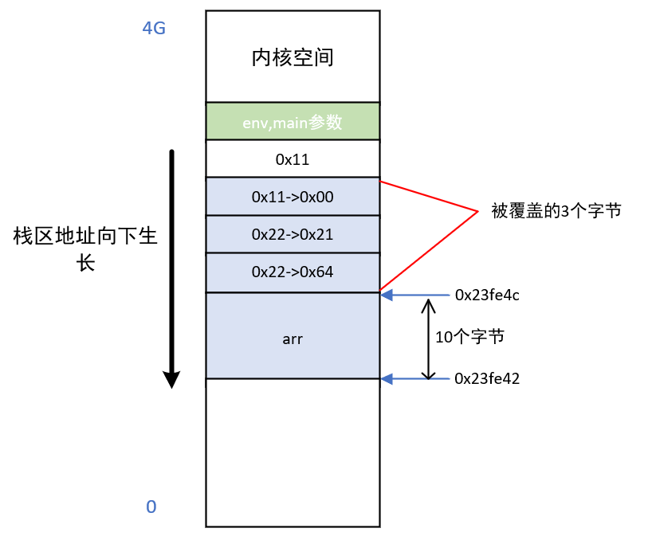

#### 1 sizeof 和 strlen 的区别 :star:3

1. `strlen`  是头文件 `<cstring>` 中的函数，`sizeof` 是 C++ 中的运算符。

2. `strlen` 测量的是字符串的实际长度（其源代码如下），以 `\0`  结束。而 sizeof 测量的是字符数组的分配大小。

   `strlen` 源代码:

   ```cpp
   size_t strlen(const char *str) {
       size_t length = 0;
       while (*str++)
           ++length;
       return length;
   }
   ```

   举例：

   ```cpp
   #include <iostream>
   #include <cstring>
   using namespace std;
   int main()
   {
       char arr[10] = "hello";
       cout << strlen(arr) << endl; // 5
       cout << sizeof(arr) << endl; // 10
       return 0;
   }

3. 若字符数组 arr 作为函数的形参，`sizeof(arr)` 中 arr 被当作字符指针来处理，`strlen(arr)` 中 arr 依然是字符数组，从下述程序的运行结果中就可以看出。

   ```  cpp
   #include <iostream>
   #include <cstring>
   using namespace std;
   void size_of(char arr[]) {
       cout << sizeof(arr) << endl; // warning: 'sizeof' on array function parameter 'arr' will return size of 'char*' .
       cout << strlen(arr) << endl; 
   }
   
   int main() {
       char arr[20] = "hello";
       size_of(arr); 
       return 0;
   }
   /*
   输出结果：
   8		// 64 位机器，指针大小是8
   5
   */
   ```

4. `strlen` 本身是库函数，因此在程序运行过程中，计算长度；而 `sizeof` 在编译时，计算长度；

5. `sizeof` 的参数可以是类型，也可以是变量；`strlen` 的参数必须是 `char*` 类型的变量。


#### 2 lambda 表达式（匿名函数）的具体应用和使用场景 :star:3

`lambda` 表达式的定义形式如下：

```cpp
[capture list] (parameter list) -> reurn type
{
   function body
}
```

其中：

- capture list：捕获列表，指 lambda 表达式所在函数中定义的局部变量的列表，通常为空，但如果函数体中用到了 lambda 表达式所在函数的局部变量，必须捕获该变量，即将此变量写在捕获列表中。捕获方式分为：引用捕获方式 [&]、值捕获方式 [=]。
- return type、parameter list、function body：分别表示返回值类型、参数列表、函数体，和普通函数一样。

举例：`lambda` 表达式常搭配排序算法使用。

```cpp
#include <iostream>
#include <vector>
#include <algorithm>
using namespace std;
int main()
{
    vector<int> arr = {3, 4, 76, 12, 54, 90, 34};
    sort(arr.begin(), arr.end(), [](int a, int b) { return a > b; }); // 降序排序
    for (auto a : arr)
    {
        cout << a << " ";
    }
    return 0;
}
/*
运行结果：90 76 54 34 12 4 3
*/
```


#### 3 explicit 的作用（如何避免编译器进行隐式类型转换） :star:3

作用：用来声明类构造函数是显式调用的，而非隐式调用，可以阻止调用构造函数时进行隐式转换。只可用于修饰单参构造函数，因为无参构造函数和多参构造函数本身就是显式调用的，再加上 `explicit` 关键字也没有什么意义。

隐式转换：

```cpp
#include <iostream>
#include <cstring>
using namespace std;
class A {
public:
    int var;
    A(int tmp)
    {
        var = tmp;
    }
};
int main() {
    A ex = 10; // 发生了隐式转换
    return 0;
}
```

上述代码中，`A ex = 10;`  在编译时，进行了隐式转换，将 `10` 转换成 `A` 类型的对象，然后将该对象赋值给 `ex`，等同于如下操作：

```cpp
A ex(10);
```


为了避免隐式转换，可用 `explicit` 关键字进行声明：

```cpp
#include <iostream>
#include <cstring>
using namespace std;
class A {
public:
    int var;
    explicit A(int tmp)
    {
        var = tmp;
        cout << var << endl;
    }
};
int main() {
    A ex(100);
    A ex1 = 10; // error: conversion from 'int' to non-scalar type 'A' requested
    return 0;
}
```


#### 4 C 和 C++ static 的区别 :star:1

- 在 C 语言中，使用 `static` 可以定义局部静态变量、外部静态变量、静态函数
- 在 C++ 中，使用 `static` 可以定义局部静态变量、外部静态变量、静态函数、静态成员变量和静态成员函数。因为 C++ 中有类的概念，静态成员变量、静态成员函数都是与类有关的概念。

#### 5 static 的作用 :star:4

`static` 定义静态变量，静态函数。

- **保持变量内容持久**：`static` 作用于局部变量，改变了局部变量的生存周期，使得该变量存在于定义后直到程序运行结束的这段时间。

  ```cpp
  #include <iostream>
  using namespace std;
  int fun(){
      static int var = 1; // var 只在第一次进入这个函数的时初始化
      var += 1;
      return var;
  }
    
  int main() {
      for(int i = 0; i < 10; ++i)
      	cout << fun() << " "; // 2 3 4 5 6 7 8 9 10 11
      return 0;
  }
  ```

- **隐藏**：`static` 作用于全局变量和函数，改变了全局变量和函数的作用域，使得全局变量和函数只能在定义它的文件中使用，在源文件中不具有全局可见性。（注：普通全局变量和函数具有全局可见性，即其他的源文件也可以使用。）
- `static` 作用于类的成员变量和类的成员函数，使得类变量或者类成员函数和类有关，也就是说可以不定义类的对象就可以通过类访问这些静态成员。注意：类的静态成员函数中只能访问静态成员变量或者静态成员函数，不能将静态成员函数定义成虚函数。

```cpp
#include<iostream>
using namespace std;
class A {
private:
    int var;
    static int s_var; // 静态成员变量
public:
    void show()
    {
        cout << s_var++ << endl;
    }
    static void s_show()
    {
        cout << s_var << endl;
		// cout << var << endl; // error: invalid use of member 'A::a' in static member function. 静态成员函数不能调用非静态成员变量。无法使用 this.var
        // show();  // error: cannot call member function 'void A::show()' without object. 静态成员函数不能调用非静态成员函数。无法使用 this.show()
    }
};
int A::s_var = 1;  // 静态成员变量在类外进行初始化赋值，默认初始化为 0

int main() {
    // cout << A::sa << endl;    // error: 'int A::sa' is private within this context
    A ex;
    ex.show();
    A::s_show();
}
```


#### 6 static 在类中使用的注意事项（定义、初始化和使用）:star: 5

**static 静态成员变量：**

1. 静态成员变量是在类内进行声明，在类外进行定义和初始化，在类外进行定义和初始化的时候不要出现 `static` 关键字和 `private`、`public`、`protected` 访问规则。
2. 静态成员变量相当于类域中的全局变量，被类的所有对象所共享，包括派生类的对象。
3. 静态成员变量可以作为成员函数的参数，而普通成员变量不可以。

```cpp
#include <iostream>
using namespace std;
class A {
public:
    static int s_var;
    int var;
    void fun1(int i = s_var); // 正确，静态成员变量可以作为成员函数的参数
    void fun2(int i = var);   //  error: invalid use of non-static data member 'A::var'
};
int main() {
    return 0;
}
```

4. 静态数据成员的类型可以是所属类的类型，而普通数据成员的类型只能是该类类型的指针或引用。

```cpp
#include <iostream>
using namespace std;
class A {
public:
    static A s_var; // 正确，静态数据成员
    A var;          // error: field 'var' has incomplete type 'A'
    A *p;           // 正确，指针
    A &var1;        // 正确，引用
};

int main() {
    return 0;
}
```

**static 静态成员函数：**

1. 静态成员函数不能调用非静态成员变量或者非静态成员函数，因为静态成员函数没有 `this` 指针。静态成员函数做为类作用域的全局函数。
2. 静态成员函数不能声明成虚函数（`virtual`）、`const ` 函数和 `volatile` 函数。

**为何 static 成员函数不能为 virtual：**

1. `static` 成员不属于任何类对象或类实例，所以即使给此函数加上 `virutal` 也是没有任何意义的。
2. 静态与非静态成员函数之间有一个主要的区别。那就是静态成员函数没有 `this` 指针。
   - 虚函数依靠 `vptr` 和 `vtable` 来处理。`vptr` 是一个指针，在类的构造函数中创建生成，并且只能用 `this` 指针来访问它，因为它是类的一个成员，并且 `vptr` 指向保存虚函数地址的 `vtable`；
   - 对于静态成员函数，它没有 `this` 指针，所以无法访问 `vptr`。 这就是为何 `static` 函数不能为 `virtual`。
   - 虚函数的调用关系：this -> vptr -> vtable ->virtual function

**为何 static 成员函数不能为 const 函数：**

1. 当声明一个非静态成员函数为 `const` 时，对 `this` 指针会有影响。对于一个 `Test` 类中的 `const` 修饰的成员函数，`this` 指针相当于 `Test const *`，而对于非 `const` 成员函数，`this` 指针相当于 `Test *`；
2. 而 `static` 成员函数没有 `this` 指针，所以使用 `const` 来修饰 `static` 成员函数没有任何意义。
3. `volatile` 的道理也是如此。

#### 7 static 全局变量和普通全局变量的异同 :star:3

**相同点**：

存储方式：普通全局变量和 static 全局变量都是静态存储方式。

**不同点**：

作用域：<u>普通全局变量</u>的作用域是整个源程序，当一个源程序由多个源文件组成时，普通全局变量在各个源文件中都是有效的；<u>静态全局变量</u>则限制了其作用域，即只在定义该变量的源文件内有效，在同一源程序的其它源文件中不能使用它。由于静态全局变量的作用域限于一个源文件内，只能为该源文件内的函数公用，因此可以避免在其他源文件中引起错误。
初始化：静态全局变量只初始化一次，防止在其他文件中使用。全局变量只初始化一次，不管是静态的还是普通的。


#### 8 const 作用及用法 :star:3

**作用**：

- `const` 修饰成员变量，定义成 `const` 常量，相较于宏常量，可进行类型检查，节省内存空间，提高了效率。
- `const` 修饰函数参数，使得传递过来的函数参数的值不能改变。
- `const` 修饰成员函数，使得成员函数不能修改任何类型的成员变量（`mutable` 修饰的变量除外），也不能调用非 `const` 成员函数，因为非 `const` 成员函数可能会修改成员变量。

**在类中的用法**：

`const` 成员变量：

- `const ` 成员变量只能在类内声明、定义，在构造函数初始化列表中初始化。
- `const ` 成员变量只在某个对象的生存周期内是常量，对于整个类而言却是可变的，因为类可以创建多个对象，不同类的 `const` 成员变量的值是不同的。因此不能在类的声明中初始化 `const` 成员变量，类的对象还没有创建，编译器不知道他的值。

`const` 成员函数：

- 不能修改成员变量的值，除非有 `mutable` 修饰；只能访问成员变量。
- 不能调用非常量成员函数，以防修改成员变量的值。

```cpp
#include <iostream>
using namespace std;
class A {
public:
	int var;
	A(int tmp) : var(tmp) {}
	void c_fun(int tmp) const // const 成员函数
	{
		var = tmp; // error: assignment of member 'A::var' in read-only object. 在 const 成员函数中，不能修改任何类成员变量。		
		fun(tmp); // error: passing 'const A' as 'this' argument discards qualifiers. const 成员函数不能调用非 const 成员函数，因为非 const 成员函数可能会修改成员变量。
	}

	void fun(int tmp)
	{
		var = tmp;
	}
};

int main() {
    return 0;
}
```


#### 9 define 和 const 的区别 :star:3

**区别**：

- **编译阶段**：`define` 是在编译预处理阶段进行替换，`const ` 是在编译阶段确定其值。

- **安全性**：`define` 定义的宏常量没有数据类型，只是进行简单的替换，不会进行类型安全的检查；`const ` 定义的常量是有类型的，是要进行判断的，可以避免一些低级的错误。

- **内存占用**：`define` 定义的宏常量，在程序中使用多少次就会进行多少次替换，内存中有多个备份，占用的是代码段的空间；`const` 定义的常量占用静态存储区的空间，程序运行过程中只有一份。

  `const` 局部变量存储在栈区，`const` 全局变量存储在已初始化数据段 ( 只读数据段 )。

- **调试**：`define` 定义的宏常量不能调试，因为在预编译阶段就已经进行替换了；`const ` 定义的常量可以进行调试。

**const 的优点**：

- 有数据类型，在定义时可进行安全性检查。
- 可调试。
- 占用较少的空间。


#### 10 define 和 typedef 的区别 :star:2

- **原理**：`#define` 作为预处理指令，在编译预处理时进行<u>替换</u>操作，不做正确性检查，只有在编译已被展开的源程序时才会发现可能的错误并报错。`typedef` 是关键字，在编译时处理，有类型检查功能，用来给一个已经存在的类型一个别名，但不能在一个函数定义里面使用 `typedef` 。
- **功能**：`typedef` 用来定义类型的别名，方便使用。`#define` 不仅可以为类型取别名，还可以定义常量、变量、编译开关等。
- **作用域**：`#define` 没有作用域的限制，只要是之前预定义过的宏，在以后的程序中都可以使用，而 `typedef` 有自己的作用域。
- **指针的操作**：`typedef` 和 `#define` 在处理指针时不完全一样。

```cpp
#include <iostream>
#define INTPTR1 int *
typedef int * INTPTR2;
using namespace std;
int main() {
    INTPTR1 p1, p2; // p1: int *; p2: int
    // 上述表达式的等价写法: int * p1, p2;
    INTPTR2 p3, p4; // p3: int *; p4: int *

    int var = 1;
    const INTPTR1 p5 = &var; // 相当于 const int * p5; 常量指针，即不可以通过 p5 去修改 p5 指向的内容，但是 p5 可以指向其他内容。
    const INTPTR2 p6 = &var; // 相当于 int * const p6; 指针常量，不可使 p6 再指向其他内容。
    
    return 0;
}
```


#### 11 用宏实现比较大小，以及两个数中的最小值 :star:1

```cpp
#include <iostream>
#define MAX(X, Y) ((X)>(Y)?(X):(Y))
#define MIN(X, Y) ((X)<(Y)?(X):(Y))
using namespace std;
int main () {
    int var1 = 10, var2 = 100;
    cout << MAX(var1, var2) << endl;
    cout << MIN(var1, var2) << endl;
    return 0;
}
/*
程序运行结果：
100
10
*/
```

如果去掉宏定义中的括号，某些时候就会出现问题。

```cpp
#define MAX(X, Y) (X > Y ? X : Y)
MAX(5+6, 6+7) => (5 + 6 > 6 + 7 ? 5 + 6 : 6 + 7)
```


#### 12 inline 作用及使用方法 :star:3

**关键字 `inline`  内联函数的作用：**

内联函数，像普通函数一样被调用，但是在调用时并不通过函数调用的机制而是直接在调用点处展开。这样可以大大减少由函数调用带来的开销，从而提高程序的运行效率。

1. 消除函数调用的开销。

   在内联函数出现之前，程序员通常用 #define 定义一些“函数”来消除调用这些函数的开销。内联函数设计的目的之一，就是取代 #define 的这项功能（因为使用 #define 定义的那些“函数”，编译器不会检查其参数的正确性等，而使用 inline 定义的函数，和普通函数一样，可以被编译器检查，这样有利于尽早发现错误）。

2. 去除函数只能定义一次的限制。
   内联函数可以在头文件中被定义，并被多个 .cpp 文件 include，而不会有重定义错误。这也是设计内联函数的主要目的之一。

**关于减少函数调用的开销**：

1. 内联函数一定会被编译器在调用点展开吗？

   错，inline 只是对编译器的建议，而非命令。编译器可以选择忽视 inline。当程序员定义的 inline 函数包含复杂递归，或者 inlinie 函数本身比较长，编译器一般不会将其展开，而仍然会选择函数调用。

2. “调用” 普通函数时，一定是调用吗？

   错，即使是普通函数，编译器也可以选择进行优化，将普通函数在“调用”点展开。

3. 既然内联函数在编译阶段已经在调用点被展开，那么程序运行时，对应的内存中不包含内联函数的定义，对吗？

   错。首先，如第一点所言，编译器可以选择调用内联函数，而非展开内联函数。因此，内存中仍然需要一份内联函数的定义，以供调用。而且，一致性是所有语言都应该遵守的准则。普通函数可以有指向它的函数指针，那么，内敛函数也可以有指向它的函数指针，因此，内存中需要一份内联函数的定义，使得这样的函数指针可以存在。

**关于去除函数只能定义一次的限制**：

- 下述程序会报错：

  ```cpp
  // 文件1
  #include <iostream>
  using namespace std;
  void myPrint() {
  	cout << "function 1";
  }
  
  // 文件2
  #include <iostream>
  using namespace std;
  void myPrint() {
  	cout << "function 2";
  }
  int main() {
  	myPrint();  // error，会出现链接时错误， myPrint 函数被定义了两次。
  }
  ```

- 下述程序不会报错：

  ```cpp
  // 文件1
  #include <iostream>
  using namespace std;
  inline void myPrint() {
  	cout << "inline function 1";
  }
  
  // 文件2
  #include <iostream>
  using namespace std;
  inline void myPrint() {
  	cout << "inline function 2";
  }
  
  int main() {
  	myPrint()	// 正常运行;
  }
  ```

可见，内联函数可以在头文件中定义（即多个 .cpp 源文件可以定义函数名、参数都一样的内联函数，而不会有重定义错误）。


**使用方法**：

1. 类内定义成员函数默认是内联函数。

   在类内定义成员函数，可以不用在函数头部加 `inline` 关键字，因为编译器会自动将类内定义的函数（构造函数、析构函数、普通成员函数等）声明为内联函数，代码如下：

   ```cpp
   #include <iostream>
   using namespace std;
   class A {
   public:
       int var;
       A(int tmp){ 
         var = tmp;
       }    
       void fun(){ 
           cout << var << endl;
       }
   };
   int main() {    
       return 0;
   }
   ```

2. 类外定义成员函数，若想定义为内联函数，需用关键字声明.。

   当在类内声明函数，在类外定义函数时，如果想将该函数定义为内联函数，则可以在类内声明时不加 `inline` 关键字，而在类外定义函数时加上 `inline` 关键字。

   ```cpp
   #include <iostream>
   using namespace std;
   class A {
   public:
       int var;
       A(int tmp){ 
         var = tmp;
       }    
       void fun();		// 类内声明不加 inline 关键字
   };
   
   inline void A::fun() {		// 类外定义函数时加上 inline 关键字
       cout << var << endl;
   }
   
   int main() {    
       return 0;
   }
   ```

   另外，可以在声明函数和定义函数的同时加上 `inline` ；也可以只在函数声明时加 `inline`，而定义函数时不加 `inline` 。只要确保在调用该函数之前把 `inline` 的信息告知编译器即可。

   

#### 13 inline 函数工作原理 :star:2

- 内联函数不是在调用时发生控制转移关系，而是在编译阶段将函数体嵌入到每一个调用该函数的语句块中，编译器会将程序中出现内联函数的调用表达式用内联函数的函数体来替换。
- 普通函数是将程序执行转移到被调用函数所存放的内存地址，当函数执行完后，返回到执行此函数前的地方。转移操作需要保护现场，被调函数执行完后，再恢复现场，该过程需要较大的资源开销。


#### 14 宏定义（define）和内联函数（inline）的区别 :star:2

- 内联函数是在编译时展开，而宏在编译预处理时展开；在编译的时候，内联函数直接被嵌入到目标代码中去，而宏只是一个简单的文本替换。
- 内联函数是真正的函数，和普通函数调用的方法一样，在调用点处直接展开，避免了函数的参数压栈操作，减少了调用的开销。而宏定义编写较为复杂，常需要增加一些括号来避免歧义。
- 宏定义只进行文本替换，不会对参数的类型、语句能否正常编译等进行检查。而内联函数是真正的函数，会对参数的类型、函数体内的语句编写是否正确等进行检查。

```cpp
#include <iostream>
#define MAX(a, b) ((a) > (b) ? (a) : (b))
using namespace std;
inline int fun_max(int a, int b) {
    return a > b ? a : b;
}
int main() {
    int var = 1;
    cout << MAX(var, 5) << endl;     
    cout << fun_max(var, 0) << endl; 
    return 0;
}
/*
程序运行结果：
5
1
*/
```


#### 15 new 的作用？:star:2

`new` 是 C++ 中的关键字，用来动态分配内存空间，实现方式如下：

```cpp
int *p = new int[5]; 
```


#### 16 new 和 malloc 如何判断是否申请到内存？ :star:2

`malloc `：成功申请到内存，返回指向该内存的指针；分配失败，返回 `NULL ` 指针。
`new `：内存分配成功，返回该对象类型的指针；分配失败，抛出 `bad_alloc ` 异常。


#### 17 delete 实现原理？delete 和 delete[] 的区别？ :star:3

`delete` 的实现原理：

- 首先执行该对象所属类的析构函数；
- 进而通过调用 `operator delete` 的标准库函数来释放所占的内存空间。

`delete` 和 `delete []` 的区别：

- `delete` 用来释放单个对象所占的空间，只会调用一次析构函数；
- `delete []` 用来释放数组空间，会对数组中的每个成员都调用一次析构函数。


#### 18 new 和 malloc 的区别，delete 和 free 的区别 :star:4

使用搭配：`malloc` 和 `free`  ； `new` 和 `delete` 。

- `malloc`、`free ` 是库函数，而 `new` 、`delete` 是关键字。

  `new` 申请空间时，无需指定分配空间的大小，编译器会根据类型自行计算；`malloc` 在申请空间时，需要确定所申请空间的大小。

- `new` 申请空间时，返回的类型是对象的指针类型，无需强制类型转换，是类型安全的操作符；`malloc` 申请空间时，返回的是 `void*` 类型，需要进行强制类型的转换，转换为对象类型的指针。

- `new` 分配失败时，会抛出 `bad_alloc` 异常；`malloc` 分配失败时返回空指针。

- 对于自定义的类型，`new` 首先调用 `operator new()` 函数申请空间（底层通过 `malloc` 实现），然后调用构造函数进行初始化，最后返回自定义类型的指针；`delete` 首先调用析构函数，然后调用 `operator delete()` 释放空间（底层通过 `free` 实现）。`malloc`、`free` 无法进行自定义类型的对象的构造和析构。

- `new` 操作符从自由存储区上为对象动态分配内存，而 `malloc` 函数从堆上动态分配内存。（自由存储区不等于堆）

**堆区和自由存储区的区别与联系**：

- malloc申请的内存在堆上，使用free释放。new申请的内存在自由存储区，用delete释放
- 堆（heap）是c语言和操作系统的术语。堆是操作系统所维护的一块特殊内存，它提供了动态分配的功能，当程序运行时调用malloc()时就会从中分配，调用free可把内存交换。而自由存储区是C++中通过new和delete动态分配和释放对象的抽象概念，通过new来申请的内存区域可称为自由存储区。基本上，所有的C++编译器默认用堆来实现自由存储区，也即是缺省的全局运算符new和delete也许会按照malloc和free的方式来实现，这时由new运算符分配的对象，说它在堆上也对，说它在自由存储区也对。

**记住**：

- 堆是c语言和操作系统的术语，是操作系统维护的一块内存。自由存储是C++中通过new和delete动态分配和释放对象的抽象概念。
- new所申请的内存区域在C++中称为自由存储区，编译器用malloc和free实现new和delete操作符时，new申请的内存可以说是在堆上。
- 堆和自由内存区有相同之处，但并不等价。


#### 18 malloc 的原理？malloc 的底层实现？:star:2

从操作系统角度来看，进程分配内存有两种方式，分别由两个系统调用完成：brk和mmap（不考虑共享内存）。

`malloc` 的原理：

- 当开辟的空间小于 128K 时，调用 `brk()` 函数，它将数据段 (.data) 的最高地址指针  `_enddata` 往高地址推；
- 当开辟空间大于 128K 时，调用 `mmap()` 函数，通过在进程的虚拟地址空间中（堆和栈中间，称为文件映射区域的地方）找一块空闲的虚拟内存。

这两种方式分配的都是虚拟内存，没有分配物理内存。在第一次访问已分配的虚拟地址空间的时候，发生缺页中断，操作系统负责分配物理内存，然后建立虚拟内存和物理内存之间的映射关系。

**问题**：为什么在默认的情况下，malloc 函数分配内存时，如果请求内存大于 128 K（可由 M_MMAP_THRESHOLD 选项调节），就不是去推 `_edata` 指针，而是利用 mmap 系统调用，从堆和栈的中间分配一块虚拟内存？

**答案**：因为 brk 分配的内存需要等到高地址内存释放之后才能释放，而 mmap 分配的内存可以单独释放。

参考资料：[linux环境内存分配原理--虚拟内存](https://www.cnblogs.com/dongzhiquan/p/5621906.html)


#### 19 C 和 C++ struct 的区别？:star:2

- 在 C 语言中 `struct` 是用户自定义数据类型；在 C++ 中 `struct` 是抽象数据类型，支持成员函数的定义。
- C 语言中 `struct` 没有访问权限的设置，是一些变量的集合体，不能定义成员函数；C++ 中 `struct` 可以和类一样，有访问权限，并可以定义成员函数。
- C 语言中 `struct` 定义的自定义数据类型，在定义该类型的变量时，需要加上 `struct` 关键字，例如：`struct A var;` ，定义 A 类型的变量；而 C++ 中，不用加该关键字，例如：`A var`;


#### 20 为什么有了 class 还保留 struct？:star:2

C++ 是在 C 语言的基础上发展起来的，为了与 C 语言兼容，C++ 中保留了 `struct`。


#### 21 struct 和 union 的区别 :star:2

说明：`union` 是联合体，`struct ` 是结构体。

区别：

- 联合体和结构体都是由若干个数据类型不同的数据成员组成。使用时，联合体只有一个有效的成员；而结构体所有的成员都有效。
- 对联合体的不同成员赋值，将会对覆盖其他成员的值，而对于结构体的对不同成员赋值时，相互不影响。
- 联合体的大小为其内部所有变量的最大值，按照最大类型的倍数进行分配大小；结构体分配内存的大小遵循内存对齐原则。

```cpp
#include <iostream>
using namespace std;
typedef union {
    char c[10];
    char cc1; // char 1 字节，按该类型的倍数分配大小
} u11;

typedef union {
    char c[10];
    int i; // int 4 字节，按该类型的倍数分配大小
} u22;

typedef union {
    char c[10];
    double d; // double 8 字节，按该类型的倍数分配大小
} u33;

typedef struct s1 {
    char c;   // 1 字节
    double d; // 1（char）+ 7（内存对齐）+ 8（double）= 16 字节
} s11;

typedef struct s2 {
    char c;   // 1 字节
    char cc;  // 1（char）+ 1（char）= 2 字节
    double d; // 2 + 6（内存对齐）+ 8（double）= 16 字节
} s22;

typedef struct s3 {
    char c;   // 1 字节
    double d; // 1（char）+ 7（内存对齐）+ 8（double）= 16 字节
    char cc;  // 16 + 1（char）+ 7（内存对齐）= 24 字节
} s33;

int main() {
    cout << sizeof(u11) << endl; // 10
    cout << sizeof(u22) << endl; // 12
    cout << sizeof(u33) << endl; // 16
    cout << sizeof(s11) << endl; // 16
    cout << sizeof(s22) << endl; // 16
    cout << sizeof(s33) << endl; // 24

    cout << sizeof(int) << endl;    // 4
    cout << sizeof(double) << endl; // 8
    return 0;
}
```


#### 22 class 和 struct 的异同 :star:2

- `struct` 和 `class` 都可以自定义数据类型，也支持继承操作。

- `struct` 中默认的访问级别是 `public` ，默认的继承级别也是 `public` ；class 中默认的访问级别是 `private`，默认的继承级别也是 `private`。

- 当 `class` 继承 `struct` 或者 `struct` 继承 `class` 时，默认的继承级别取决于 `class` 或 `struct` 本身， `class`（`private`继承），`struct`（`public` 继承），即取决于派生类的默认继承级别。

  ```cpp
  struct A{}；
  class B : A{}; // private 继承 
  struct C : B{}； // public 继承
  ```

  举例：

  ```cpp
  #include<iostream>
  using namespace std;
  class A {
  public:
      void funA(){
          cout << "class A" << endl;
      }
  };
  
  struct B: A { // 由于 B 是 struct，A 的默认继承级别为 public
  public:
      void funB(){
          cout << "class B" << endl;
      }
  };
  
  class C: B { // 由于 C 是 class，B 的默认继承级别为 private，所以无法访问基类 B 中的 funB 函数
  
  };
  
  int main() {
      A ex1;
      ex1.funA(); // class A
  
      B ex2;
      ex2.funA(); // class A
      ex2.funB(); // class B
  
      C ex3;
      ex3.funB(); // error: 'B' is not an accessible base of 'C'.
      return 0;
  }
  ```

  参考资料：[C++的三种访问权限与三种继承方式](https://blog.csdn.net/luoweifu/article/details/46953343)


#### 23 volatile 的作用？是否具有原子性，对编译器有什么影响？ :star:2

`volatile` 的作用：当对象的值可能在程序的控制或检测之外被改变时，应该将该对象声明为 `volatile`，告知编译器不应对这样的对象进行优化。

`volatile` 不具有原子性。

`volatile` 对编译器的影响：使用该关键字后，编译器不会对相应的对象进行优化，即不会将变量从内存缓存到寄存器中，防止多个线程有可能使用内存中的变量，有可能使用寄存器中的变量，从而导致程序错误。


> 《程序员的自我修养》原话：

我们可以使用 `volatile` 关键字试图阻止过度优化，`volatile`  基本可以做到两件事情：

1. 阻止编译器为了提高速度将一个变量缓存到寄存器内而不写回；（缓存一致性协议、轻量级同步）；
2. 阻止编译器调整操作 `volatile` 变量的指令排序。

```cpp
// 即使 `volatile` 能够阻止编译器调整顺序，也无法阻止 CPU 动态调度换序。

// 要保证线程安全，阻止 CPU 换序是必须的。遗憾的是，现在并不存在可移植的阻止换序的方法。
//通常情况下是调用 CPU 提供的一条指令，这条指令常常被称为 barrier。
// 一条 barrier 指令会阻止 CPU 将该指令之前的指令交换到 barrier 之后。
```

对 `volatile` 的三点理解：

1. 只能保证赋值原子性，复合操作不能保证；
2. 告诉编译器不进行指令重排（ JMM 中还会追加 CPU 内存屏障），以避免过度优化；
3. 保证内存可见性。


#### 24 什么情况下一定要用 volatile， 能否和 const 一起使用？:star:2

使用  `volatile` 关键字的场景：

- 当多个线程都会用到某一变量，并且该变量的值有可能发生改变时，需要用  `volatile` 关键字对该变量进行修饰；
- 中断服务程序中访问的变量或并行设备的硬件寄存器的变量，最好用  `volatile` 关键字修饰。
-  `volatile` 关键字和 `const` 关键字可以同时使用，某种类型可以既是 `volatile` 又是 `const`，同时具有二者的属性。

解决多线程中变量同步问题，最好使用 `automic` 保持吧，`volatile` 并不一定能够保持。


#### 25 返回函数中静态变量的地址会发生什么？:star:2

```cpp
#include <iostream>
using namespace std;
int * fun(int tmp) {
    static int var = 10;
    var *= tmp;
    return &var;
}
int main() {
    cout << *fun(5) << endl;
    return 0;
}
/*
运行结果：
50
*/
```

说明：上述代码中在函数 fun 中定义了静态局部变量 `var`，使得离开该函数的作用域后，该变量不会销毁，返回到主函数中，该变量依然存在，从而使程序得到正确的运行结果。但是，该静态局部变量直到程序运行结束后才销毁，浪费内存空间。


#### 26 extern C 的作用？:star:2

当 C++ 程序需要调用 C 语言编写的函数，C++ 使用链接指示，即 `extern "C"` 指出任意非 C++ 函数所用的语言。

```cpp
// 可能出现在 C++ 头文件<cstring>中的链接指示
extern "C"{
    int strcmp(const char*, const char*);
}
```

C++ 和 C语言编译函数签名方式不一样， extern关键字可以让两者保持统一，这样才能找到对应的函数。


#### 27 sizeof(1==1) 在 C 和 C++ 中分别是什么结果？:star:1

```cpp
// C 语言
#include<stdio.h>
void main() {
    printf("%d\n", sizeof(1==1));
}
/*
运行结果：
4
*/

// 解释：
// sizeof（1 == 1） === sizeof（1）
// 按照整数处理，所以是4字节，这里也有可能是8字节（看操作系统）


// C++
#include <iostream>
using namespace std;
int main() {
    cout << sizeof(1==1) << endl;
    return 0;
}
/*
1
*/

// 因为有bool 类型
// sizeof（1 == 1） == sizeof（true） 按照bool类型处理，所以是1个字节

```


#### 28 memcpy 函数的底层原理？:star:3

参考资料：[关于C函数memcpy的实现细节思考](https://blog.csdn.net/yuanrxdu/article/details/23771459)


#### 29 strcpy 函数有什么缺陷？:star:2

`strcpy` 函数的缺陷：`strcpy` 函数不检查目的缓冲区的大小边界，而是将源字符串逐一的全部赋值给目的字符串地址起始的一块连续的内存空间，同时加上字符串终止符，会导致其他变量被覆盖。

```cpp
#include <iostream>
#include <cstring>
using namespace std;
int main() {
    int var = 0x11112222;
    char arr[10];
    cout << "Address : var " << &var << endl;
    cout << "Address : arr " << &arr << endl;
    strcpy(arr, "hello world!");
    cout << "var:" << hex << var << endl; // 将变量 var 以 16 进制输出
    cout << "arr:" << arr << endl;
    return 0;
}

/*
Address : var 0x23fe4c
Address : arr 0x23fe42
var:11002164
arr:hello world!
*/
```

**说明**：从上述代码中可以看出，变量 `var` 的后六位被字符串 `"hello world!"` 的 `"d!\0"` 这三个字符改变，这三个字符对应的 ascii 码的十六进制为：`\0` (0x00)，`!` (0x21)，`d` (0x64)。

**原因**：变量 `arr` 只分配的 10 个内存空间，通过上述程序中的地址可以看出 `arr` 和 `var` 在内存中是连续存放的，但是在调用 `strcpy` 函数进行拷贝时，源字符串 `"hello world!"` 所占的内存空间为 13，因此在拷贝的过程中会占用 `var` 的内存空间，导致 `var` 的后六位被覆盖。

<div align = center></div>


#### 30 auto 类型推导的原理:star:2

`auto` 类型推导的原理：

编译器根据初始值来推算变量的类型，要求用 `auto` 定义变量时必须有初始值。编译器推断出来的 `auto` 类型有时和初始值类型并不完全一样，编译器会适当改变结果类型使其更符合初始化规则。
