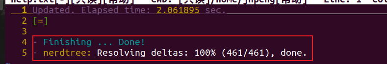
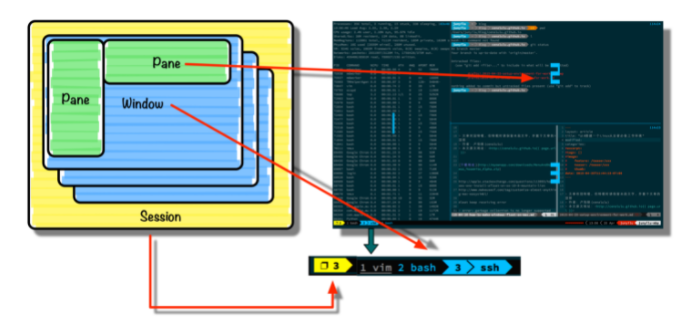

## Vim 使用指南

`vim` 编辑器是在终端运行的文本代码编辑器。

```sequence
Title: 标题：Vim 编辑器三种模式切换
命令模式->插入模式: 输入 i
Note left of 命令模式: 进入 vim 的初始状态
Note right of 底线命令模式: 保存退出:wq，退出:q，强制退出:q!
插入模式->命令模式: ESC
命令模式->底线命令模式: 输入:
底线命令模式->命令模式: 命令以回车结束运行
# participant C
# Note right of C: 没人陪我玩
```


一般我们可以在 `github` 上找别人配置好的 `.vimrc`  文件。

```shell
$ vim ~/.vimrc		#在当前用户的根目录下新建 .vimrc 文件

# 底线命令模式输入以下命令
$ syntax on			# 语法高亮
$ set number		# 设置行号
$ set nonumber		# 取消行号设置

# 设置好 vim 配置文件之后，保存退出之后，下次再进入就自动设置了语法高亮并且设置了行号
```

常用的 `vim` 快捷键

```shell
h（左） j（下） k（上） l （右）
w	# 每次跳一个单词
b	# 往回跳
ctrl + f	# forword 往下翻页
ctrl + b	# 往上翻页
88gg		# 跳到 88 行

# 往下，往上跳指定行 
10j			# 往下跳 10 行
10k			# 往上跳 10 行

/[内容]			# 查找内容 
按下 n 键可以跳到下一个查找的目标结果，shift + n 跳到上一个目标结果

cc	# 剪贴当前行
c2c	# 剪贴底下两行
u	# 撤销删除操作
pp	# 粘贴刚刚剪贴的内容

# 批量选择
# 1. 命令模式中，按下 v 进入 visual 模式，然后搭配 hjkl（左下上右）键位使用，进行批量选择。
# 2. 搭配 c（剪贴） p（粘贴） u（撤销）键位使用
yy	# 复制当前行内容

# 自动补全
ctrl + n	# 出现选项之后，按下 enter
```


:star: `vim` 插件管理器 + **vim 自动补全插件**

- 预先安装 `git` 和 `curl`

- 安装 vim plug 插件（vim 插件管理软件），在 github 上下载；[链接](https://github.com/junegunn/vim-plug)

- ```shell
  curl -fLo ~/.vim/autoload/plug.vim --create-dirs \
      https://raw.githubusercontent.com/junegunn/vim-plug/master/plug.vim
  ```

- 修改 `~/.vimrc` 文件

  ```shell
  # 末尾添加
  call plug#begin()
  	Plug 'scrooloose/nerdtree'		# 添加的插件名字
  call plug#end()
  ```

- 任意打开一个文件，假设我们 `vim code.cpp`，然后在 `code.cpp` 的底线命令模式下输入 `:PlugInstall`

> https://github.com/junegunn/vim-plug
>
> https://vimawesome.com/plugin/nerdtree-red





:star: 上面所示我们已经安装了一个插件 `NERDTree` ，使用方式：

1. 首先随意打开一个文件，假设打开 `vim code.c` 

2. 输入 `:NERDTree`，实现像目录一样浏览系统中的文件

   ```shell
   # 切换左右两边窗口
   按两次 ctrl + w
   
   # 打开该文件
   Enter
   ```

:star: 每次使用 `vim` 都打开 `NERDTree` 插件的解决方法：

```shell
# Just write this line to your .vimrc :
autocmd VimEnter * NERDTree
```

>[execute nerdtree automatically](https://stackoverflow.com/questions/3788903/how-to-start-vim-with-nerd-tree-opened-automatically#)

:star: 删除插件的方法

```shell
PlugClean
```


## Tmux 使用指南

`tmux` 是 linux 中一种管理窗口的程序，支持多标签、分割窗口以及窗口组随时存储和恢复的功能。`tmux` 的主要元素分为三层：

- *Session* 一组窗口的集合， 通常用来概括同一个任务。*session* 可以有自己的名字便于任务之间的切换。
- *Window* 单个可见窗口。*Windows* 有自己的编号，也可以认为和 ITerm2 中的 *Tab* 类似。
- *Pane* 窗格，被划分成小块的窗口，类似于 *Vim* 中 C-w +v 后的效果。



`tmux`：即使关闭 tmux，下次重新 attch 时，之前的东西还在服务器后台运行。为便于表述我们定义 `pre = ctrl + b` ，实际上我们使用时一般会修改 `tmux` 配置文件 `vim ~/.tmux.conf`，将快捷键 `ctrl+b` 改为 `ctrl+a`。

```bash
### panes
pre + %		# 水平分割 pane
pre + "		# 垂直分割 pane
exit		# 退出pane
pre + z		# 放大当前的 pane
pre + z		# 复原之前的 pane 状态(缩小)
pre + 上下左右	# 切换 pane
alt + 上下左右	# 切换 pane（这个需要修改配置文件）

### windows
pre + c		# 创建一个新的 window
pre + 数字1，2		# 在不同window 之间移动
pre + &		# 关闭当前 window
# 重命名window，创建一个新的 window 之后，除了数字编号不同外，window 名称都是一样的
pre + ,		# 更改 window 名称

### session
tmux ls		# 查看所有的 session(正常运行显示 attach)
pre + $		# 每个 session 一般对应于一个 project
tmux new -s [名字]	# 创建 session 时直接命名
pre + d			# 退出session（挂起）
tmux a -t [名字]	# 重新连接某个session
tmux a		# 仅有一个session 时这是最快的连接方式
tmux kill-session -a -t [名字] # 删除[名字]以外的session
```

从 `tmux` 中往外复制东西的方法：

先按住 `shift` 不放，用鼠标选中复制的内容，松开 `shift` ，再按 `ctrl+insert` 复制；然后在电脑上按 `shift+insert` 粘贴。 


常用的 `tmux` 配置，`vim ~/.tmux.conf` 。

```bash
# Send prefix: ctr + b 改为 ctr + a
set-option -g prefix C-a
unbind-key C-a
bind-key C-a send-prefix

# Use Alt-arrow keys to switch panes
# 不用 prefix，直接 alt + 箭头在 pane 之间 switch
bind -n M-Left select-pane -L
bind -n M-Right select-pane -R
bind -n M-Up select-pane -U
bind -n M-Down select-pane -D

# Shift arrow to switch windows
# 不用按prefix，直接用shift+箭头在window之间switch
bind -n S-Left previous-window
bind -n S-Right next-window

# Mouse mode
set -g mouse on

# Set easier window split keys
bind-key v split-window -h
bind-key h split-window -v

# Easy config reload
bind-key r source-file ~/.tmux.conf \; display-message "tmux.conf reloaded"
```

更改了 `.tmux.conf` 后，在 `tmux` 里的快捷键没有变化。`tmux` 只有在新建 *session* 的时候，才会去找 `tmux.conf` 文件。

所以，之前创建的 *session* 都没有参考 `tmux.conf`， 所以可以用`tmux lstmux kill-session -a` 仅仅保留当前 *session*。再删除当前 `session`  `tmux kill-session -t py27`。这下删除了所有创建好的 *session*。


> [tmux简洁教程及config关键配置](https://www.jianshu.com/p/fd3bbdba9dc9)
>
> https://www.ruanyifeng.com/blog/2019/10/tmux.html
>
> http://cenalulu.github.io/linux/tmux/
>
> https://harttle.land/2015/11/06/tmux-startup.html
