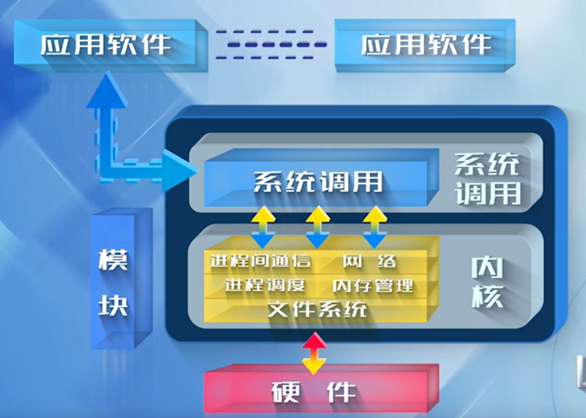
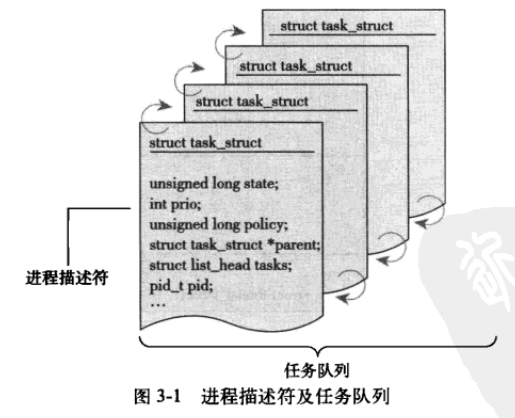

# Linux 内核设计与实现-笔记

> 《Linux 内核设计与实现》- 中文第三版

## 第 1 章 Linux 内核简介

操作系统：

- 是一个系统软件，管理计算机硬件以及软件资源；【提高资源利用率】
- 为计算机程序提供服务。【方便用户使用】

**Linux 系统整体结构**：



系统调用作用：充当应用程序和操作系统内核之间的接口，为应用程序提供各种服务（文件系统、内存、进程调度）。系统调用机制，其实就是 “**隔离变化**”。

**Linux 设计理念**：机制与策略分离。

- 机制：提供什么样的功能；
- 策略：如何使用这些功能；

通常一个内核由负责响应中断的中断服务程序，负责管理多个进程从而分享处理器时间的调度程序，负责管理进程地址空间的内存管理程序和网络、进程间通信等系统服务程序共同组成。

每个处理器在任何指定时间点上的活动必然概括为以下三者之一：

- 

- 运行于用户空间，执行用户进程；
- 运行于内核空间，处于进程上下文，代表某个特定的进程执行；
- 运行于内核空间，处于中断上下文，与任何进程无关，处理某个特定的中断。

Linux 是一个单内核，Linux 内核运行在单独的内核地址空间上。所有的内核服务都在这样一个大的内核地址空间上运行。内核之间的通信开销可以忽略，内核可以直接调用函数。

- Linux 支持动态加载内核模块，即允许动态的卸除和加载部分内核代码；
- Linux 支持对称多处理（SMP）机制；
- Linux 内核可以抢占；


*推荐书籍*：《Linux 内核设计与实现》、《深入理解 Linux 内核》


## 第 3 章 进程管理

### 3.1 进程

**进程**：处于执行期的程序，并包括其他资源，如打开的文件，挂起的信号，内核内部数据，处理器状态，一个或多个具有内存映射的内存地址空间及一个或多个执行线程，存放全局变量的数据段。

**线程**：每个线程都拥有一个独立的程序计数器、进程栈和一组进程寄存器。

调用 `fork()` 的进程成为父进程，新产生的进程成为子进程，在该调用结束时，在返回点这个相同位置上，父进程恢复执行，子进程开始执行。 `fork()` 系统调用从内核中返回两次：一次回到父进程，另一次回到新产生的子进程。


### 3.2 进程描述符及任务结构

内核将进程的列表存放在任务队列（task list）的双向循环链表中，链表中每一项都是类型为 `task_struct`、称为进程描述符（process descriptor） 的结构，该结构定义在 `<linux/sched.h>` 文件中。

进程描述符包含的数据可以完整描述一个正在执行的程序：它打开的文件，进程的地址空间，挂起的信号，进程的状态。



Linux 通过 `slab` 分配器分配 `task_struct` 结构，以便达到对象复用和缓存着色（cache coloring）的目的。`slab` 分配器动态生成的 `task_struct` 只需要创建一个新的结构 `struct thread_info`。

内核通过一个唯一的进程标识值或 PID 来标识每个进程。PID 的最大值默认是 32768，该值最大受到 `<linux/threads.h>` 中所定义的 PID 最大值限制。PID 最大值实际上就是系统中允许同时存在的进程的最大数目。

内核中访问任务（进程）需要获得指向其 `task_struct` 的指针。采用 x86 架构的内核，由于寄存器较少，只能在内核栈的尾端创建 `thread_info` 结构，通过计算偏移来间接查找 `task_struct` 结构。PPC 内核当前 `task_struct` 是保存在一个寄存器中（因为访问进程描述符繁琐，使用寄存器加快访问速度）。

进程描述符中的 `state` 域描述了进程的当前状态，系统中的进程必然处于这五种状态之一：

- TASK_RUNNING（运行）——进程是可执行的；它或者是正在执行，或者在等待队列中等待执行。
- TASK_INTERRUPTIBLE（可中断）——进程正在睡眠（被阻塞），等待信号或者资源唤醒。
- TASK_UNINTERRUPTIBLE（不可中断）——只能等待资源唤醒。
- __TASK_TRACED——被其他进程跟踪的进程。
- __TASK_STOPPED——进程停止执行；进程没有投入运行也不能投入运行。

设置当前进程状态：

```c
set_task_state(task, state);	// 将任务 task 的状态设置为 state
```

当一个程序执行了系统调用或者触发了某个异常，就陷入了内核空间。此时，称内核“代表进程执行” 并处于进程上下文中。

所有的进程都是 `PID = 1` 的 `init`  进程的后代。内核在系统启动的最后阶段启动 `init` 进程，该进程读取系统的初始化脚本并执行其他的相关程序，并完成系统启动的整个过程。

### 3.3 进程创建

`fork()` ：拷贝当前进程创建一个子进程。子进程和父进程的区别仅仅在于 PID（每个进程唯一）、PPID（父进程的进程号，子进程将其设置为被拷贝进程的 PID）和某些资源和统计量。

`exec()` ：读取可执行文件并将其载入地址空间开始运行。

**写时拷贝（copy-on-write）**：推迟甚至免除拷贝数据的技术。内核此时并不复制整个进程地址空间，而是让父进程和子进程共享同一份拷贝。在需要写入的时候，才会复制数据，从而使得各个进程拥有各自的拷贝。写入发生之前，数据以只读的方式进行共享。`fork()` 的实际开销就是复制父进程的页表以及给子进程创建唯一的进程描述符。

---

`fork()` 的实现：`clone()` 系统调用。该系统调用借助参数标志来指明父子进程之间需要共享的资源。`fork(), vfork(), __clone()` 库函数根据各自需要的参数标志来调用 `clone()` ，然后由 `clone()` 调用 `do_fork()`。

`do_fork()` 定义在 `kernel/fork.c` 文件中，该函数调用 `copy_process()` 函数，然后让进程开始执行。`copy_process()` 函数完成的工作：

1. 调用 `dup_task_struct()` 为新进程创建一个内核栈、`thread_info` 结构和 `task_struct` ，这些值与当前进程保持一致。（此时父子进程描述符一样）
2. 检查确保新创建这个进程之后，当前用户拥有的进程数目没有超过分配的资源限制。
3. 子进程描述符中的许多成员需要清 0 或者设为初始值。
4. 子进程状态设置为 `TASK_UNINTERRUPTIBLE` ，等待资源唤醒；
5. `copy_process()` 调用 `copy_flags()` 更新 `task_struct` 的 `flags` 成员。
6. 调用 `alloc_pid()` 为新进程分配一个有效的 PID；
7. 根据传递给 `clone()` 的参数标志，`copy_process()` 拷贝或共享打开的文件、文件系统信息、信号处理函数、进程地址空间和命名空间。
8. `copy_process()` 返回一个指向子进程的指针。

再回到 `do_fork()` 函数，如果 `copy_process()`  函数成功返回，新创建的子进程被唤醒并让其投入使用。内核有意选择让子进程首先执行（实际运行执行顺序不定），因为一般子进程会马上调用 `exec()` 函数，这样可以避免写时拷贝的额外开销，如果让父进程先执行的话，有可能会向地址空间写入。

---

`vfork()` 实现：相比于 `fork()` 函数而言，不拷贝父进程的页表项。子进程作为父进程的一个单独的线程在它的地址空间里运行，父进程被阻塞，直到子进程退出或者执行 `exec()` 。子进程不能向地址空间写入。`vfork()` 的系统调用实现是通过向 `clone()` 系统调用传递一个特殊标志来进行的。

1. 调用 `copy_process` 时，`task_struct` 的 `vfor_done` 成员被设置为 `NULL`；
2. 执行 `do_fork()` 时，如果给定特别标志，则 `vfork_done` 会指向一个特定地址；
3. 子进程先开始执行后，父进程不是马上恢复执行，而是一直等待，直到子进程通过 `vfork_done` 指针向它发送信号；
4. 调用 `mm_release()` 时，该函数用于进程退出内存地址空间，并检查 `vfork_done` 是否为空，如果不为空，则会向父进程发送信号；
5. 回到 `do_fork()` ，父进程醒来并返回。


### 3.4 线程在 Linux 中的实现

线程机制提供了在同一个程序内共享内存地址空间运行的一组线程，该机制提供了同一程序内共享内存地址空间运行的一组线程。

Linux 内核角度而言，并没有线程这个概念。Linux 将所有的线程都当做进程来实现，内核并没有特别的调度算法或者定义特别的数据结构来表征线程。相反，线程仅仅被视为一个与其他进程共享某些资源的进程。

每个线程都拥有唯一隶属于自己的 `task_struct` ，所以在内核中它就是一个轻量级的进程。

---

线程的创建和普通的进程创建类似，只不过在调用 `clone()` 时需要传递一些参数标志来指明需要共享的资源。

```c
clone(CLONE_VM | CLONE_FS | CLONE_FILES | CLONE_SIGHAND, 0);
// 上面的代码产生的结果与调用 fork() 差不多，父子进程共享地址空间、文件系统资源、文件描述符和信号处理程序
clone(SIGCHLD, 0);		// 普通 fork()
clone(CLONE_VFORK | CLONE_VM | SIGCHLD, 0);		// vfork() 实现
```

---

**内核线程**：独立运行在内核空间的标准进程。

**内核线程与普通进程之间的区别**：内核线程没有独立的地址空间（实际上指向地址空间的 mm 指针被设置为 `NULL`）。内核线程仅在内核空间中运行，从不切换到用户空间中去，内核进程和普通进程一样，可以被调度，也可以被抢占。


### 3.5 进程终结

进程终结时，内核需要释放它所占有的资源并告知其父进程。进程的析构是自身引起的，发生在进程调用 `exit()` 系统调用时，即可能显式地调用这个系统调用，也可能隐式地从某个程序的主函数返回。

进程终结任务，大部分需要靠 `do_exit()` 完成。

---

**删除进程描述符**

调用 `do_exit()` 之后，线程已经不能运行，但是系统还保存着它的进程描述符。（让子进程终结之后，仍然可以获得它的信息，这就是为什么进程终结时的清理工作和进程描述符删除被分开执行）

`wait()` 函数族都是通过一个唯一的系统调用 `wait4()` 来实现的，它的标准动作是挂起它的进程，直到其中一个子进程退出，此时函数会返回该子进程的 PID。

最终需要释放进城描述符时，会调用 `release_task()` 。

---

**孤儿进程**

如果父进程在子进程之前退出，需要有机制来保证该子进程能找到一个新的父亲，否则会这些成为孤儿的进程在退出时会永远处于 `zombie` 状态。

**解决机制**：给子进程在当前线程组中找一个线程作为父亲，如果不行，就让 `init()` 作为它们的父进程。


## 第 4 章 进程调度

进程调度程序：在可运行态进程之间分配有限的处理器时间资源的内核子系统。

### 4.1 多任务

**多任务操作系统**：能同时并发地交互执行多个进程的操作系统，它能使得多个进程出于阻塞和睡眠状态。

**分类**：

- **抢占式多任务**（preemptive multitasking）：调度程序决定什么时候停止进程运行。

  进程的时间片：分配个每个可运行进程的处理器时间段，现代操作系统广泛采用动态时间片计算的方式，并引入了可配置的计算策略。

- 非抢占式多任务（cooperative multitasking）：除非进程自己主动停止运行，否则会一直执行。

  主动挂起自己（让步，yielding）。


### 4.2 Linux 的进程调度

$O(1)$ 调度：Linux 2.5 开发系列内核所用的进程调度程序。

- 优点：对大服务器的工作负载很理想；
- 缺点：不适用于响应时间敏感的程序，缺少交互进程。

为了提高对交互程序的调度进行，Linux 2.6.23 内核中使用反转楼梯最后期限调度算法（Rotating Staircase Deadline scheduler, RSDL）。

RSDL 调度：借助队列理论，将公平调度概念引入了  Linux 调度程序。

CFS 调度：完全公平调度算法，RSDL 调度的改进版本。


### 4.3 策略

策略：决定调度程序什么时候让进程运行，优化使用处理器时间。

**进程分类**：

- I / O 消耗型：大部分时间用于提交 IO 请求，或者等待 IO 请求；
- 处理器消耗型：大部分时间用于执行代码；

对于处理器消耗型进程，调度策略往往是：降低其调度频率，延长其运行时间，如大量数学计算的程序。

调度策略：在两个矛盾的目标中寻找平衡：进程响应迅速（响应时间短）和最大系统利用率（高吞吐量）。

---

**进程优先级**

**基于优先级的调度**：最基本的调度算法。优先级高的进程先运行，相同优先级的进程按照轮转方式进行调度。调度程序总是选择时间片未用尽而且优先级最高的进程运行。

Linux 使用的两种优先级范围：

1. `nice` 值，范围 $[-20,19]$，默认值为 $0$。`nice` 值越大表示优先级越低，低 `nice` 值的可以获得更多的处理器时间。Linux 系统中，`nice` 值表示时间片的比例，可通过 `ps -el` 命令查看系统中进程列表，`NI` 列表示进程对应的 `nice` 值；
2. 实时优先级范围，默认情况下其变化范围是 $[0, 99]$ 。越高的实时优先级数值表示进程优先级越高，任何实时进程的优先级高于普通进程。查看方式：`ps -eo state,uid,pid,ppid,rtprio,time,comm`，对应列为 `-` 表示其不是实时进程。

---

**时间片**

时间片：表示进程被抢占前所能持续运行的时间。时间片过长会导致系统对交互的响应表现欠佳；时间片过短会明显增大进程切换带来的处理器耗时。

IO 消耗型的进程不需要消耗较长的时间片，处理器消耗器的进程则越长越好（可以让他们的高速缓存命中率更高）。

Linux 的 CFS 调度器并没有直接分配时间片到进程，而是将处理器的使用比例划分给进程，进程所获得的处理器时间与系统负载密切相关。


### 4.4 Linux 调度算法

Linux 调度器是以模块方式提供的，目的是允许不同类的进程可以针对性地选择调度算法。这种模块化的结构就称为调度器类，它允许多种不同的可动态添加的调度算法并存，调度属于自己范畴的进程。每个调度器有一个优先级，它会按照优先级顺序遍历调度类，拥有一个可执行进程的最高优先级的调度器类胜出，去选择下面要执行的那个程序。

完全公平调度（CFS）：针对普通进程的调度类。

---

CFS 采取的方法是对时间片分配方式进行根本性的重新设计（就进程调度器而言）：完全摒弃时间片而是分配给进程一个处理器使用比重。通过这种方式，CFS 确保了进程调度中能有恒定的公平性，而将切换频率置于不断变动中。

---

**公平调度**

CFS 的出发点是基于理念：进程调度的效果应如同系统具备一个理想中的完美多任务处理器。在这种系统中，每个进程将能获得 $1/n$ 的处理器时间—— $n$ 是指可运行进程的数量。同时，我们可以调度给它们无限小的时间周期，所以在任何可测量周期内，我们给予 $n$ 个进程中每个进程同样多的运行时间。

任何进程所获得的处理器时间是由它自己和其他所有可运行进程 $nice$ 值的相对差值决定的。$nice$ 值对时间片的作用不再是算数加权，而是几何加权。任何 $nice$ 值对应的绝对时间不再是一个绝对值，而是处理器的使用时间比。CFS 称为公平调度器是因为它确保每个进程公平的处理器使用比。

 

### 4.5 Linux 调度的实现

- 时间记账
- 进程选择
- 调度器入口
- 睡眠和唤醒

**时间记账**

所有的调度器都必须对进程运行时间做记账。

**进程选择**

CFS 调度算法的核心：选择具有最小 `vruntime` 的进程。

CFS 使用红黑树来组织可运行进程队列，并利用其迅速找到最小 `vruntime` 的进程。

**调度器入口**

主要入口点是函数 `schedule()` 。

**睡眠和唤醒**

休眠（被阻塞）的进程出处于特殊的不可执行状态。进程休眠是为了等待某些事件。

进程休眠时，内核的操作：进程将自己标记为休眠状态，从可执行红黑树中移出，放入等待队列，然后调用  `schedule()`  选择和执行一个其他的进程。

唤醒的过程：进程被设置为可执行状态，然后再从等待队列中移到可执行红黑树中。


### 4.6 抢占和上下文切换

上下文切换：从一个可执行进程切换到另一个可执行进程。

内核即将返回用户空间的时候，如果 `need_resched` 标志被设置，会导致 `schedule()` 被调用，此时就会发生用户抢占。

用户抢占在以下情况时产生：

- 从系统调用返回用户空间时；
- 从中断处理程序返回用户空间时；

---

Linux 完整地支持内核抢占。只要重新调度是安全的，内核就可以在任何时间抢占正在执行的任务。

**什么时候重新调度才是安全的**？

只要没有持有锁，内核就可以进行抢占。锁是非抢占区域的标志。由于内核是支持 SMP 的，所以如果没有锁，正在执行的代码就是可以重新导入的，也就是可以抢占的。

支持内核抢占的操作：

1. 为每个进程的 `thread_info` 引入 `preempt_count` 计数器。计数器初始值为 0，每当使用锁的时候数值加 1，释放锁的时候数值减 1。数值为 0 的时候，内核就可执行抢占。
2. 如果内核中的进程被阻塞了，或它显式地调用了 `schedule()`，内核抢占会显式地发生。

**内核抢占发生的场景**：

- 中断处理程序正在执行，且返回内核空间之前；
- 内核代码再一次具有可抢占性；
- 如果内核中的任务显式地调用 `schedule()`；
- 如果内核中的任务被阻塞。


### 4.7 实时调度策略

Linux 中有两种实时调度策略：`SCHED_FIFO` 和 `SCHED_RR`。

普通的、非实时的调度策略：`SCHED_NORMAL` 。

---

**实时调度策略 1**：`SCHED_FIFO` 

简单的、先入先出的调度算法，不使用时间片。`SCHED_FIFO`  的进程被调度优先级高于任何`SCHED_NORMAL` 的进程，一旦一个 `SCHED_FIFO` 级进程处于可执行状态，就会一直执行，直到它自己受到阻塞或者显式地释放处理器为止；它不基于时间片，可以一直执行下去。只有更高优先级的 `SCHED_FIFO`  或者  `SCHED_RR` 任务才能抢占  `SCHED_FIFO`  任务。相同优先级的  `SCHED_FIFO`  进程会轮流执行，但是依然只有在它们愿意让出处理器时才会退出。

**实时调度策略 2**：`SCHED_RR` 

`SCHED_RR` 级的进程在耗尽事先分配给它的时间之后就不能继续执行了，可以理解为带有时间片的 `SCHED_FIFO` 。当 `SCHED_RR` 任务时间片用完时，同一优先级的其他实时进程被轮流调度。时间片只用来重新调度同一优先级的进程。

对于 `SCHED_FIFO` ， 高优先级的总是立即抢占低优先级，但低优先级的不能抢占 `SCHED_RR` 任务，即使它的时间片用完。

 


