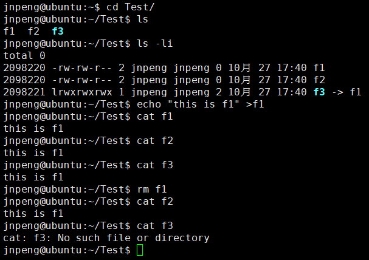

本文将对 Linux 系统进行简要介绍，并总结概括 Linux 系统下常用命令。

Linux 是一套免费使用和自由传播的类 Unix 操作系统，是一个基于 POSIX 和 UNIX 的多用户、多任务、支持多线程和多 CPU 的操作系统。

|       | 区别                                         | 联系                         |
| ----- | -------------------------------------------- | ---------------------------- |
| Linux | 开源；可移植性强；使用简单；个人或企业用户； | 网络为核心的设计思想源于Unix |
| Unix  | 商业软件银行（IBM 的 AIX）；高端定制化应用； |                              |

## 1 Linux 基础

**Linux 启动流程：**


**内核引导**：`BOIS` 自检并按照 `BIOS` 中设置的启动设备（硬盘）启动。

**运行** `init` ：`init` 进程是系统所有进程的起点；

**运行级别**：许多程序需要开机启动，Windows 系统中称为服务 `service`，Linux 系统中是守护进程 `daemon` 。`init` 进程任务之一就是去运行这些开机启动的程序。（Linux 系统服务器用作服务器时，需要启动 `Apache`）。运行级别就是针对不同场合设置不同的程序启动时机，Linux 系统中有 7 级。

**系统初始化**：激活交换分区，检查磁盘，加载硬件模块等。

**用户登录系统**：命令行、`ssh` 登录、图形界面；

**Linux 关机流程**：


```bash
$ man			# 查看帮助文档
$ sync			# 将数据由内存同步到硬盘中。
$ shutdown		#关机指令
$ reboot		#重启 == shutdown –r now	和	init 6
$ halt			#关闭系统 == shutdown –h now 和 poweroff	和 init 0
```

---

```bash /
├── bin -> usr/bin	# 常用的程序和指令
├── boot		# 启动 Linux 的内核文件，包括连接文件和镜像文件
├── dev			# Linux 外部设备
├── etc			# 系统的配置文件和子目录列表。更改将可能导致系统不能启动
├── home		# 普通用户的主目录
├── lib -> usr/lib		# lib 基本代码库（C++库），基本动态连接共享库
├── lib32 -> usr/lib32
├── lib64 -> usr/lib64
├── libx32 -> usr/libx32
├── lost+found	# 一般情况下是空的，当系统非法关机后，这里会存放一些文件
├── media		# 类似 Windows 的其他设备
├── mnt			# 共享文件夹（实现Windows和Linux虚拟机文件共享）
├── opt			# 默认为空，我们安装额外软件可以放在这个里面
├── proc		# 管理内存空间
├── root		# 系统管理员用户主目录
├── run			# 临时文件系统，存放系统启动以来的信息
├── sbin -> usr/sbin	# 系统管理员才能用的程序和指令
├── srv			# 存放服务启动后需要提取的数据
├── swapfile
├── sys			# 内核源代码默认的放置目录
├── tmp			# 存放临时文件
├── usr			# unix shared resources，存放很多应用软件和文件
└── var			# 不断更改的文件，各种日志文件
```

---

**命令解析器**：Linux 系统中提供了 `shell` （/bin/sh）、`bash`（/bin/bash）等，一般默认使用 `bash` 作为解析器。

```bash
$ tab		# 补齐命令，补齐路径，显示当前目录下的所有目录
$ clear		# 清屏
$ ctrl + l	# 清屏
$ ctrl + c	# 中断进程
$ ctrl + u	# 删除光标前所有内容
$ ctrl + k	# 删除光标后的所有内容
```


## 2 文件管理

### ls 命令 – 显示指定目录下的内容及属性信息

```bash
$ ls [参数] 目录路径
$ ls -l		# 查看当前目录下的详细信息，功能等价于 ll 命令
$ ls -a		# 查看当前目录下的所有文件（包含隐藏文件）
$ ls -la 	# 查看当前目录下的所有文件（包含隐藏文件）的详细信息
$ ls -lh	# 查看当前目录下的文件的详细信息（增加可读性，带单位）
$ ls --help	# 查看命令帮助文档
```

### cd 命令 - 切换目录

相对路径：不是以 `/` 开头的路径。

```bash
.		# 表示当前目录
..		# 表示当前目录的上一级目录
~		# 表示当前用户的根目录，切记是当前用户

$ cd ./bin	# 进入当前目录下的 bin 目录，功能等价于 cd bin/
$ cd ../etc	# 进入和当前目录同级的 etc 目录
```

### mkdir 命令 – 创建目录

```bash
$ mkdir dir		# 在当前目录下创建一个 dir 目录，功能等价于 mkdir ./dir
$ mkdir	/root/tmp	# 在 /root 目录下创建一个 tmp 目录
$ mkdir -p a/b/c	# 在当前目录下创建 3 级目录
```

### rmdir 命令 – 删除空目录

```bash
$ rmdir [参数] 目录路径		# 默认仅删除空目录
$ rmdir	./dir	# 删除当前目录下的 dir 目录
$ rmdir -p a/b/c	# 删除当前目录下的 a/b/c 目录
```

### touch 命令 - 创建文件

```bash
$ touch 1.txt	# 当前目录下创建一个 1.txt 文件
$ touch ~/1.txt	# 当前用户的根目录下创建一个 1.txt 文件
```

### rm 命令 - 删除文件

```bash
$ rm [参数] 路径
$ rm -r a	# 递归删除当前目录下 a 以及 a 目录 下的所有内容
$ rm -f 1.txt	# 强制删除该文件，不会提示
$ rm -rf a/		# 强制删除当前目录下的 a 目录以及 a 目录下的所有内容
$ rm -rf *		# 强制删除当前目录下的所有内容
$ rm -rf *.txt	# 强制删除当前目录下的所有 txt 文件
$ rm -rf *s*	# 删除当前目录下所有名字中包含 s 的文件或文件夹
```

### pwd 命令 -- 查看当前路径

Linux 下所有的绝对路径都是从根目录 `/` 开始，`/root` 是 root 用户的根目录，`/home` 是其他用户的默认根目录。

### cp 命令 – 拷贝文件

```bash
$ cp 1.txt a/		# 将 1.txt 文件拷贝到 a 目录下
$ cp 1.txt 2.txt	# 将 1.txt 文件内容拷贝到 2.txt 文件中
$ cp -r a data		# 将 a 目录递归地拷贝 data 目录中
```

### scp 命令 - 远程拷贝文件

该命令可以将本地文件拷贝到远程服务器，也可以将远程服务器的文件拷贝到本地，也可将一台服务器文件拷贝到另一台服务器。

```bash
# 将本地文件拷贝到远程服务器
$ scp -r 本地文件路径 用户名@ip[:port]:远程路径
# 将本地的 2.txt 文件拷贝到 172.18.7.111 的 /root/data/ 目录下
$ scp -r 2.txt root@172.18.7.111:/root/data/

# 远程文件拷贝到本地
$ scp -r 用户名@ip[:port]:远程文件路径 本地路径
# 将远程的/root/2.txt 文件拷贝到本地的 /root/data 目录
$ scp -r root@172.18.7.111:/root/2.txt /root/data

# 服务器与服务器之间
$ scp -r 用户名@ip[:port]:远程文件路径 用户名@ip[:port]:远程文件路径
# 将 /root/tmp 拷贝到远程的 /root/data 目录下
scp -r root@192.168.5.105:/root/tmp root@192.168.5.105:/root/data/
```

### mv命令 – 移动或改名文件

```bash
$ mv 1.txt 2.txt	# 文件 1.txt 改名为 2.txt 文件
$ mv a b			# 目录 a 改名为 b
$ mv 1.txt b		# 文件 1.txt 移动到 b 目录下
```

### tar 命令 - 文件打包以及解打包

```bash
$ tar [选项] 打包文件名 文件		# 文件打包以及解打包
$ tar -cvf	# 创建归档文件
$ tar -xvf	# 解除归档文件
$ tar -tvf	# 查看归档文件内容

$ tar cvf 2.tar 2.txt	# 将 2.txt 压缩为 2.tar 包
$ tar cvf a.tar a		# 将 a 目录下打包到 a.tar 文件中

$ tar xvf 2.tar		# 将 2.tar 解压到当前目录
$ tar xvf 2.tar -C a/	# 将 2.tar 解压到 a 目录
$ tar xvf data.tar		# 解压 data.tar 到当前目录

$ tar zcvf	tm.tar.gz tm	# 将当前目录下的 tm 目录压缩为 tm.tar.gz
$ tar zxvf tm.tar.gz		# 将 tm.tar.gz 解压到当前目录
```

### gzip 命令 - 文件压缩和解压缩

```bash
$ gzip [选项] 被压缩文件	# tar 和 gzip 命令结合使用实现文件打包、压缩
#	-d	解压
#	-r	压缩所有文件

$ gzip 2.txt	# 将 2.txt 压缩为 2.txt.gz
$ gzip data.tar # 将 data.tar 压缩为 data.tar.gz
```


## 3 文档编辑

### echo 命令 – 输出字符串或提取 Shell 变量的值

```bash
$ echo Hello	# 打印 Hello
$ echo $PATH	# 打印环境变量 PATH 的值，$ 是取变量值的符号，用法：$变量名 或者 ${变量名}
$ echo -n Hello		# 打印内容但不换行
```

### > 和 >> 命令 - 输出符号

`>` 表示覆盖（删除原文件的内容），`>>` 表示追加。

```bash
$ echo Hello > 1.txt	# 将 Hello 输出到当前目录下的 1.txt 文件
	# 如果当前目录下没有 1.txt 文件，就会创建一个新文件
	# 如果当前目录下有 1.txt 文件，就会删除原文件的内容
$ echo 123 >> 1.txt	# 将 123 追加到当前目录下的 1.txt 文件中，如果不存在该文件需要创建一个新的文件
```

### cat命令 – 在终端上显示文件内容

```bash
$ cat 1.txt		# 查看当前目录下 1.txt 文件中的内容
```

### more, less 命令 - 分页查看文件内容

```bash
$ more 文件所在路径	# 按空格或回车会继续加载文件内容，按 q 退出查看，加载到文件末尾时会自动退出

$ less 文件所在路径	# 按空格继续加载文件，按 q 退出查看，不会自动退出查看
```

### head, tail 命令 - 从头，从尾查看文件内容

```bash
$ head -n 文件路径		# 查看文件的前 n 行数据
$ tail -n 文件路径		# 查看文件的后 n 行数据
$ tail -f 文件路径		# 动态的查看文件的最后几行内容
```

注意：`tail -f` 一般用来查看日志文件，按下 `ctrl + c` （暂停进程）或者 `ctrl + z` （停止进程）才会退出查看。

### wc 命令 - 查看文件的单词个数

```bash
$ wc -l 1.txt	# -l 表示 line 行数，统计文件 1.txt 的行数
$ wc -w 1.txt	# -w 表示 word 单词个数，统计文件 1.txt 的单词个数
```

### find 命令 - 特定目录下查找文件

使用参数 `-name` 按文件名查询，使用参数 `-size` 按照文件大小查询，使用参数 `-type` 按照文件类型查询。

```bash
$ find 路径 -name "文件名"
$ find /home -name "a.txt"
$ find *.txt	# 查找 txt 文件

$ find 路径 -size 范围
# +100k	# 大小大于 100k
# -100k	# 大小小于 100k

$ find 路径 -type 类型
# d 目录, l 符号链接, b 块设备文件, c 字符设备文件, s socket 文件, p 管道
```

### grep 命令 - 查找内容

:star: `grep` 对文本文件进行模式匹配，如果找到匹配模式，`grep` 打印包含模式的所有行。

```bash
$ grep [-选项] '搜索内容串' 文件名
# -v 显示不包含匹配文本的所有行
# -n 显示匹配行以及行号
# -i 忽略大小写

grep cat 1.txt	# 在 1.txt 文件中查找包含 cat 的行

| 管道符号	# 连接两个命令，将前一个命令的查询结果传给后一个命令
$ ps -ef | grep sshd	# 查看系统中 sshd 的进程

$ grep -v cat 1.txt		# 查找 1.txt 文件中不包含 1.txt 的行
$ ps -ef | grep sshd | grep -v grep	# 查询 sshd 进程，不包含 grep 的行
```


## 4 磁盘管理

### free 命令 - 查看系统内存

```bash
$ free	# 查看系统内存的使用情况
$ free -h	# 查看内存使用情况，以合适度量单位进行显示
```

### df 命令 - 列出文件系统的整体磁盘使用量

```bash
$ df	# 查看系统磁盘的使用情况
$ df -h	# 查看系统硬盘使用，以合适度量单位进行显示
```

### du 命令 - 检查磁盘空间使用量

### ps 命令 - 查看系统进程的命令

```bash
$ ps -aux
$ ps -ef
```

### kill 命令 - 结束进程

```bash
kill 88742	# 结束 PID 为 88742 的进程
kill -9 PID_id	# 强制结束进程
```


## 5 用户和权限管理

### groupadd / groupdel 命令 - 创建/删除一个用户组

```bash
$ groupadd bows	# 创建一个叫 bows 的用户组
$ groupdel bows	# 当 bows 用户组下没有用户时，删除 bows 用户组
```

### useradd / userdel 命令 - 创建/删除用户，用户管理

```bash
# 创建一个用户，-g 指定用户的主用户组，-G 指定用户的其他用户组
$ useradd username [-g 用户组名 -G 用户组名]
$ id username	# 查看用户的 id

$ userdel username	# 删除用户

$ su username	# 切换用户，但不加载用户的环境变量
$ su - username	# 切换用户，并加载用户的环境变量（建议方式）
# 加载用户根目录下的 .bash_profile 环境变量配置文件

$ exit			# 退出当前用户的登录

$ passwd username	# 修改用户密码

$ r: 读权限，对应数字表示 4
$ w: 写权限，对应数字表示 2
$ x: 可执行权限，对应数字表示 1
$ +: 加上权限，-: 去掉权限

# Linux 常用两个命令来修改文件或目录的所属用户和权限
$ chmod 权限 文件路径
$ chmod u+x	2.txt/Bob	# 给文件/用户加上执行权限
```


## 6 其他命令

### source 命令 - 让配置文件修改结果立即生效

```bash
$ source /etc/profile	# 让配置文件 /etc/profile 生效
```

### export 命令

```bash
$ export 导入全局变量（环境变量）
```

### << EOF - 将 << EOF 和 EOF 之间的多行内容传给前面的命令

```bash
jnpeng@aliyun:~$ cat << EOF
> A
> B
> C
> EOF
A
B
C
```

### cut 命令 - 截取命令

```bash
-f 参数，指定列
-d 参数，参数指定列和列之间的分隔符，默认的分隔符是 \t （行向制表符）
cut -f 1 1.txt	# 取 1.txt 文件中的第 1 列内容（列分隔符默认为\t）
cut -f 1 -d ',' 2.txt	# 取 2.txt 文件中的第 1 列内容，列分隔符为，
```

### printf 命令

```bash
$ %ns	# 输出字符串，n 是数字，指代输出几个字符
$ %ni	# 输出整数，n 是数字，指代输出几个数字
$ %m.nf	# 位数和小数位数。例如：%8.2f 代表输出 8 位数，其中2位是小数，6位是整数
```

### service 命令

```bash
enable | disable | start | stop | restart | status
start: 启动服务
stop: 关闭服务
restart: 重启服务
status: 查看服务状态
```

### tree - 树形显示指定目录内容

### 安装包管理

```bash
$ sudo apt install <package_name>	# 安装指定的软件
$ sudo apt update <package_name>	# 更新指定的软件
$ sudo apt update	# 列出所有可以更新的软件清单命令
$ sudo apt show <package_name>	# 显示软件包具体信息
$ sudo apt remove <package_name>	# 删除软件包命令
$ sudo apt upgrade	# 升级软件包
$ apt list --upgradeable	# 列出可更新的软件包及版本信息
```

### Linux 文件链接

Linux 文件链接分为两种：硬链接（Hard Link），符号链接（Symbolic Link）。

**硬链接**：通过索引节点进行链接。Linux 文件系统中每个文件分配了一个索引节点号，Linux 中多个文件名指向同一个索引节点。一个索引节点对应两个不同的文件名，两个文件名指向同一个文件，删除其中一个不会影响另外一个的访问。

**软链接**：类似快捷方式，假设 B 是 A 的软链接，B 的目录项中的 inode 节点号与 A 中的目录项中的 inode 节点号不同，B 和 A 指向的是两个不同的 inode ，继而指向两块不同的数据块。但是 B 的数据块中存放的是 A 的路径名，A 和 B 之间是主从关系，如果 B 删除了，A 仍然存在，但指向一个无效的链接。

```shell
$ touch f1		#创建一个测试文件 f1
$ ln f1 f2		#创建f1的一个硬连接文件f2
$ ln -s f1 f3	#创建f1的一个符号连接文件f3
$ ls -li		# -i 参数显示文件的inode节点信息
```



测试结果：删除原始文件 `f1` 之后，硬连接 `f2` 不受影响，但是符号连接 `f3` 文件失效。


## 参考

> [详解Linux与Unix系统的区别与联系](https://linux.cn/article-3159-1.html)
>
> 华为云开发者社区：[Linux 命令大全](https://blog.csdn.net/devcloud/article/details/112648614?ops_request_misc=%257B%2522request%255Fid%2522%253A%2522163680083016780357265345%2522%252C%2522scm%2522%253A%252220140713.130102334.pc%255Fblog.%2522%257D&request_id=163680083016780357265345&biz_id=0&utm_medium=distribute.pc_search_result.none-task-blog-2~blog~first_rank_v2~rank_v29-19-112648614.pc_v2_rank_blog_default&utm_term=Linux&spm=1018.2226.3001.4450)
>
> [Linux 命令大全](https://www.linuxcool.com/)