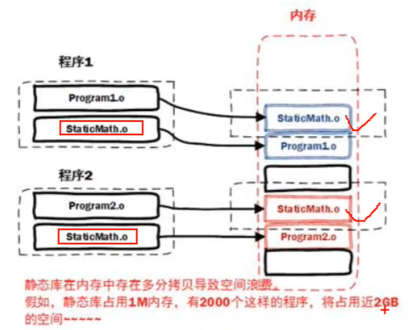
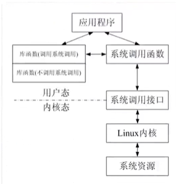

## C++ 编译调试

### gcc

`gcc` （GNU Complier Colection, GNU 编译器套件），是由 GNU 开发的编译语言编译器。`gcc` 最初用于编译 C 语言，现在已经能够编译 C++、Java 以及 Go 语言等。


编译工具链：

- 预处理器：`cpp` ，进行头文件展开，宏替换，注释去掉；`gcc -E`
- 编译器：`gcc` ，将 c 文件变成汇编文件；`gcc -S`
- 汇编器：`as` ，汇编文件变成二进制文件；`gcc -c`
- 链接器：`ld`，将函数库中相应的代码组合到目标文件中；

```bash
gcc code.c -o code
```


### 静态连接与动态连接

**静态链接**：链接器在链接时将库的内容加入到可执行程序中。

优点：对运行环境依赖小，兼容性好；

缺点：生成程序较大，需要更多的系统资源，装入内存时会消耗更多的时间；库函数更新之后必须重新编译应用程序。

**动态链接**：链接器在链接时仅建立与所需库函数之间的链接关系，在程序运行时才将所需的资源调入可执行程序。

优点：需要时才调入对应的资源函数；简化程序的升级，有着较小的程序体积；实现进程之间的资源共享；

缺点：依赖动态库，不能独立运行；动态库依赖版本问题严重；


### 静态库以及动态库

程序库就是包含了数据和执行码的文件，其不能单独执行，可以作为其它执行程序的一部分来完成某些功能，库的存在可以使得程序模块化，加快程序的再编译，实现代码复用。

#### 静态库的制作


```bash
# 静态库的制作
# 1. 将 c 源文件生成对应的 .o 文件
gcc -c add.c -o add.o
gcc -c sub.c -o sub.o
gcc -c mul.c -o mul.o

# 2. 使用打包工具 ar 将准备好的 .o 文件打包为 .a 文件 libtest.a
ar -rcs libtest.a add.o sub.o mul.o

### ar 工具使用时，添加的参数 rcs 的含义
r		# 更新
c		# 创建
s		# 建立索引
```


#### 静态库的使用

静态库制作完成之后需要将 `.a` 头文件一起发布给用户。假定测试文件为 `main.c` ，静态库文件为 `libtest.a` 头文件为 `head.h`。

```bash
# 编译命令
gcc test.c -L. -l. -ltest -o test
```

  参数说明：

- -L ：表示要连接的库所在目录；
- -l（小写L）：指定链接时需要的库，去掉前缀和后缀



#### 动态库的制作

共享库在程序编译时并不会被连接到目标代码中，而是在程序运行时才被载入。不同的应用程序如果调用相同的库，那么在内存里只需要有一份该共享库的实例。

动态库在程序运行时才被载入，解决了静态库对程序的更新、部署和发布页会带来的麻烦，用户只需要更新动态库即可，实现增量更新。

动态库以 `.so` 作为文件后缀名，共享库的命名一般分为三个部分：

- 前缀：lib
- 库名称：自己定义
- 后缀：`.so`

**制作步骤**：

1. 生成目标文件，此时需要加上编译选项：`-fPIC`
2. 生成共享库，此时要加上链接器选项，`-shared`（生成动态链接库）
3. 通过 `nm` 命令查看对应的函数


### GDB

GNU 工具集中的调试器是 GDB（GNU Debugger），该程序是一个交互式工具，工作在字符模式。GDB 功能：启动程序，设置断电，查看程序运行信息，动态改变程序运行环境。

GDB 一般是用于调试 C / C++ 程序，首先在编译时，我们需要将调试信息加到可执行文件中，使用编译器 （gcc / g++）的 `-g` 参数可以做到这一点。如：

```bash
gcc -g hello.c hello
g++ -g hello.c hello
```

#### 启动 GDB

- 启动 gdb：`gdb program`

  program 也就是你的执行文件，一般在当前目录下；

- 设置运行参数

  ```bash
  set args		# 可指定运行时参数
  show args		# 命令可以查看设置好的运行参数
  ```

- 启动程序

  ```bash
  run		# 程序开始执行，如果有断点，停在第一个断点处
  start	# 程序向下执行一行

####   编译调试命令

```bash
### 显示源代码
list	# 打印程序源代码，默认显示 10 行源代码
set	listsize count		# 设置一次显示源代码的行数

### 断点
b 10	# 设置断点，在源程序第 10 行
b func	# 设置断点在 func 函数入口处

### 查询所有断点
info b
info break
i break
i b

### 条件断点
b test.c:8 if i = 5

### 调试代码
run		# 运行程序，简写为 r
next	# 单步跟踪，跳过函数体，简写为 n
step	# 单步跟踪，不跳过函数体，简写为 s
finish	# 退出进行的函数
until	# 在一个循环体内单步跟踪时，这个命令可以运行程序直到退出循环体，简写为 u
continue	# 继续运行程序，停在下一个断点位置,简写为 c
quit	# 退出 gdb，简写为 q
```


## 3 Linux 系统相关

### 3.1 系统调用

系统调用：操作系统提供给用户程序调用的一组特殊接口。

用户态，内核态

### 3.2 系统调用和库函数的区别

Linux 下对文件的操作有两种方式：系统调用（system call）和库函数调用（library functions）

库函数由两类函数组成：

1. 不需要调用系统调用：不需要切换到内核空间即可完成函数全部功能，并且将程序结果反馈给应用程序，如 `strcpy` 函数；
2. 需要调用系统调用：需要切换到内核空间，这类函数通过封装系统调用去实现相应功能，如 `printf`、`fread`。




系统调用需要时间，程序中频繁使用系统调用会降低程序的运行效率。当运行内核代码时，CPU 工作在内核态，在系统调用发生前需要保存用户态的栈和内存环境，然后转入内核态工作。系统调用结束之后，又要切换到用户态，这种环境切换会消耗很多时间。

### 3.3 错误处理函数

`errno` 是记录系统的最后一次错误代码，代码是一个 `int` 型的值，在 `errno.h` 文件中定义。查看错误代码 `errno` 是调试程序的一个重要方法。

Linux C api 函数发生异常时，一般会将 `errno` 全局变量赋一个整数值，不同的值代表不同的含义，可以通过查看该值来推测错误的原因。

```c
#include<stdio.h>
#include<errno.h>
#include<string.h>
// errno 是一个全局变量，在 errno.h 头文件中定义
// errno 是保存系统中最近出错的错误码
int main() {
    // 打开文件
    FILE *fp = fopen("txt", "r");
    if (NULL == fp) {
        printf("fopen failed...\n");
        printf("errno: %d\n", errno);
        // 根据 errno 的值解析出错误原因
        printf("fopen: %s\n", strerror(errno));
        // 根据 errno 值输出错误信息
        perror("fopen");
        
        return 1;
    }
    return 0;
}
```

### 3.4 虚拟地址空间

每个进程都会分配虚拟地址空间，在 32 位机器上，该地址空间为 4G 。

在进程中平时说的指针变量，保存的就是虚拟地址，当应用程序使用虚拟地址访问内存时，处理器（CPU）会将其转化为物理地址（MMU）。


### 3.5 文件描述符

系统调用中 I/O 的函数（I：input，输入；O：output，输出），对文件进行相应的操作（open()、close()、write()、read() 等）。


## 4 文件和目录操作函数

### 4.1 stat 函数

```c
#include<sys/types.h>
#include<sys/stat.h>
#include<unistd.h>

int stat(const char *path, struct stat *buf);
int lstat(const char *pathname, struct stat *buf);

功能：
    获取文件状态信息
    stat 和 lstat 的区别：
    当文件是一个符号链接时，lstat 返回的是该符号链接本身的信息；
    而 stat 返回的是该链接指向的文件的信息。
参数：
    path：文件名
    buf：保存文件信息的结构体
返回值：
    成功：0
    失败：-1
```


