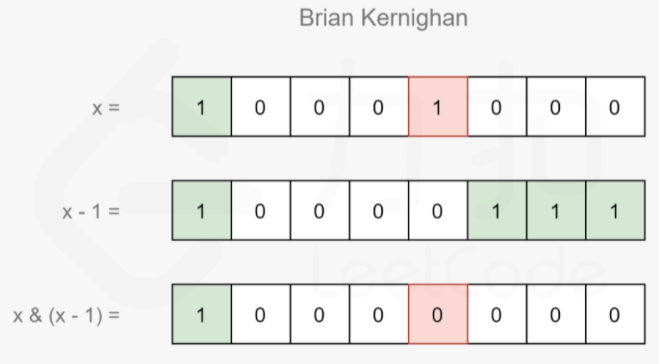

## 位操作

位操作的源码使用位运算：`AND、OR、XOR、NOT` 和移位，由于位操作是可以并行处理的，通常可以避免对于某数据结构的循环操作，从而在执行速度上会有较大提升，但是降低了代码的可读性。

### 基础知识

位操作的核心是位运算符 &、|、~、^ （与、或、非、异或）以及移位运算符 a << b 和 a >> b 。

```cpp
A | B					// 取并集
A & B					// 取交集
A & ~B					// 取补集
ALL_BITS ^ A 或者 ~A	   // 所有位取反
A |= 1 << bit			// 将某位设置为 1
A &= ~(1 << bit)		// 将某位设置为 0
(A & 1 << bit) != 0	或者 (A >> bit) & 1			// 检验某位
A & -A 或者 A & ~ (A-1) 或者x ^ (x & (x-1))		// 提取最低位的1
A & (A-1)				// 移除最后一位1
~0						// 获取全1比特位
```

### 位操作技巧

- 异或操作符 `^` 删除完全相同的数字然后保存剩下的，或者保存不同的位然后移除相同位
- `|`  操作符可以留存尽可能多的1
- `&` 可以筛选指定位

#### 1. 检查整数是奇数还是偶数

判断整数最低位比特是1则为奇数，反之最低位比特为0则为偶数。

```cpp
x & 1
```

#### 2. 测试第 n 位比特

将与运算的1向左平移相应位数即可。假设向左平移 n 位，接下来的与运算就是只保留第 n 位。

```cpp
122 & (1 << 3)	// 测试122的第3位比特是否为1
```

#### 3. 将第 n 位设为 1 或不变

类似前面的技巧，将与运算 `&` 换成或运算 `|` 。与 1 进行或运算将参与运算的位置设置为1，与 0 进行或运算将参与运算的位不变。

```cpp
y = x | (1 << n)
```

#### 4. 将第 n 位设为 0

关键就是 `~(1 << n)` ，它将第 n 位设置为0，其它位全部为1：

```cpp
y = x & ~(1 << n)
```

#### 5. 将第 n 位取反

```cpp
// ^ 运算特性
x ^ x = 0
1 ^ 0 = 1
y = x ^ (1 << n)	// 将 x 的 第 n 位取反
```


## 位操作的应用

工程应用领域：误差检测、校正算法、数据压缩、加密算法以及优化算法。

下面介绍位运算在数学中的应用：

#### 1. 统计数x 中比特位为1的总数

Brian Kernighan 算法：设`f(x) = x & (x - 1)` ，则`f(x)` 为 x 删去其二进制表示中最右侧的1的结果。



```cpp
int count_one(int n) {
    int count = 0;
    while(n) {
        n &= n - 1;
        ++count;
    }
    return count;
}

int hammingWeight(uint32_t n) {
    ulong mask = 1;
    int count = 0;
    for(int i = 0; i < 32; ++i){
        if(n & mask) 	++count;
        mask <<= 1;
    }
    return count;
}
```


例子：LC [461. 汉明距离](https://leetcode-cn.com/problems/hamming-distance/)

思路分析：首先，汉明距离就是两整数对应位上不同的比特位数。基于Brian Kernighan 算法，我们只需计算 $z = x\oplus y$ ，并利用**Brian Kernighan 算法**统计 `z` 中比特位为1的位数，这样每循环一次都会删去 $z$ 二进制表示中最右侧的1，循环次数就是 $x 和 y$ 的汉明距离。

#### 2. 数组中任意两个数之间汉明距离的总和

LC[477. 汉明距离总和](https://leetcode-cn.com/problems/total-hamming-distance/)：对于 [4,14,2] ，统计 (4, 14) + (4, 2) + (14, 2) = 6；

思路：遍历数组中的每个元素，统计每个元素在第 i 位上比特值为 1 的情况总和，对于第 i 位有 汉明距离为 `非零元素数 * （n - 非零元素数）`。

```cpp
int totalHammingDistance(vector<int>& nums) {
    int count = 0, n = nums.size();
    for (int i = 0; i < 32; ++i) {		// 10^9 最大元素，判断nums 中最大元素不会超过32位
        int notZero = 0;
        for (int &num : nums) {
            if (num & (1 << i))     ++notZero;
      		// notZero += (num >> i) & 1;    
        }
        count = count + notZero * (n - notZero);   // 非零元素数 * （n - 非零元素数）
    }
    return count;
}
```

#### 3. 判断某数字是否为2的n次方(n>=0)

一个数 $n$ 是 2 的幂，当且仅当  $n$  是正整数，并且  $n$  的二进制表示中仅包含 1 个 1。

思路1：提取  $n$  的二进制表示中最低位的 1 ，再判断剩余的数值是否为 0。

```cpp
class Solution {
public:
    bool isPowerOfTwo(int n) {
        return n > 0 && (n & (n - 1)) == 0;
    }
};
```

思路2：提取 $n$ 的二进制表示中最低位的1，若 $n$ 是正整数且 $n \& (-n) = n$ ，那么 $n$ 就是 2 的幂。

```cpp
class Solution {
public:
    bool isPowerOfTwo(int n) {
        return n > 0 && (n & (-n)) == n;
    }
};
```

思路3：除上述两种通过二进制表示进行判断的方法外。还可以**判断是否为最大 2 的幂的约数**，在题目给定的 32 位有符号整数的范围内，最大的 2 的幂为 $2^{30}$ 。我们只需判断 n 是否是  $2^{30}$ 的约数即可。

```cpp
class Solution {
private:
    static constexpr int BIG = 1 << 30;
public:
    bool isPowerOfTwo(int n) {
        return n > 0 && BIG % n == 0;
    }
};
```


#### 4. 判断某数字是否为3的n次方(n>=0)

思路：换底公式，log3(n) 是否为整数

```cpp
class Solution {
public:
    bool isPowerOfThree(int n) {
        if (n <= 0)     return false;
        double a = log10(n) / log10(3);     // 换底公式
        return a == floor(a);       // 判断log3(n) 是否为整数
    }
};
```

思路：**判断是否为最大 3 的幂的约数**，在题目给定的 32 位有符号整数的范围内，最大的 3 的幂为 $3^{19}$ 。我们只需判断 n 是否是   $3^{19}$的约数即可。

```cpp
class Solution {
    static constexpr int BIG = 1162261467;   // 3_19
public:
    bool isPowerOfThree(int n) {
        return n > 0 && BIG % n == 0;
    }
};
```


#### 5. 判断某数字是否为4的n次方(n>=0)

思路：若 $n$ 是 4 的幂，那么 $n$ 的二进制表示中有且仅有一个 1 ，并且这个 1 出现在从低位开始的第**偶数**个二进制位上。

```cpp
// 是就返回该数，不是就返回0
bool isPowerOfFour(int n) {
    return n > 0 && !(n & (n - 1)) && n & 0x55555555;
}
```


```cpp
bool isPowerOfFour(int n) {
    return n > 0 && !(n & (n - 1)) && n % 3 == 1;
}
```


#### 6. 使用 ^ 和 & 求两数之和

```cpp
int getSum(int a, int b) {
    return b==0? a:getSum(a ^ b, (a & b) << 1); 
}
```

#### 7. 寻找丢失数字：给一个包括从 0 到 n 的各不相同的 n 元数组，从中找出丢失的那个数字，如给你的数组为 [0, 1, 3]，则应该返回 2

```cpp
int missingNumber(vector<int>& nums) {
    int ret = 0;
    for(int i = 0; i < nums.size(); ++i) {
        ret ^= i;
        ret ^= nums[i];
    }
    return ret ^= nums.size();
}
```

#### 8. 找到小于等于自然数 N 的 2 的最大倍数

```cpp
long largest_power(long N) {
    // 将所有右侧位变为1.
    N = N | (N>>1);
    N = N | (N>>2);
    N = N | (N>>4);
    N = N | (N>>8);
    N = N | (N>>16);
    return (N+1) >> 1;
}
```

#### 9. 反转一个 32 位的无符号数

```cpp
uint32_t reverseBits(uint32_t n) {
    unsigned int mask = 1<<31, res = 0;
    for(int i = 0; i < 32; ++i) {
        if(n & 1) res |= mask;
        mask >>= 1;
        n >>= 1;
    }
    return res;
}
uint32_t reverseBits(uint32_t n) {
	uint32_t mask = 1, ret = 0;
	for(int i = 0; i < 32; ++i){
		ret <<= 1;
		if(mask & n) ret |= 1;
		mask <<= 1;
	}
	return ret;
}
```

#### 10. 给定一个范围[m, n]，其中 0<=m<=n<=2147483647，返回在这个范围内的所有数的按位进行 AND 操作之后的数字，比如范围为 [5, 7]，那返回的应该是按位进行计算的 5+6+7，结果是 4（100）

```cpp
int rangeBitwiseAnd(int m, int n) {
    int a = 0;
    while(m != n) {
        m >>= 1;
        n >>= 1;
        a++;
    }
    return m << a; 
}
```

#### 11. 位操作交换两个变量

```cpp
a = a ^ b; 
b = a ^ b;  // 实际上是(a^b)^b 也就是a异或了b两次，等号右边是a的值
a = a ^ b;  // 此时b实际上是(a^b)^a，也就是b异或了a两次，是b
```


参考文章：

[一些位操作的技巧 | Merrier说](https://merrier.wang/20170321/some-bit-manipulation-techniques.html)

[A summary: how to use bit manipulation to solve problems easily and efficiently](https://discuss.leetcode.com/topic/50315/a-summary-how-to-use-bit-manipulation-to-solve-problems-easily-and-efficiently)
