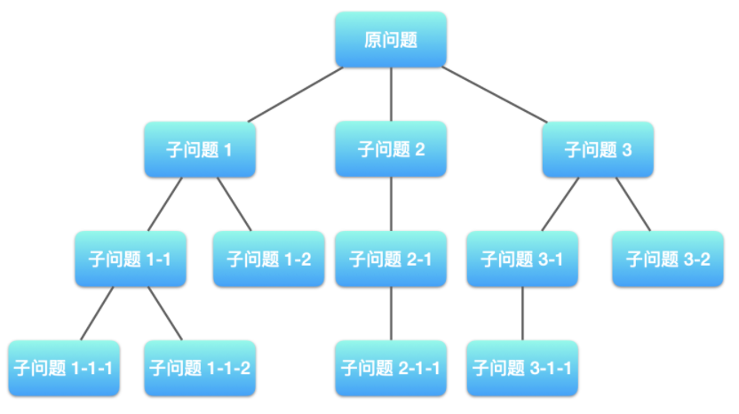
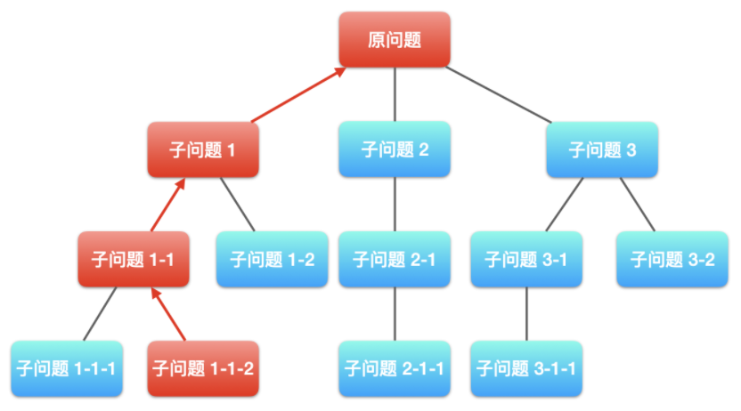
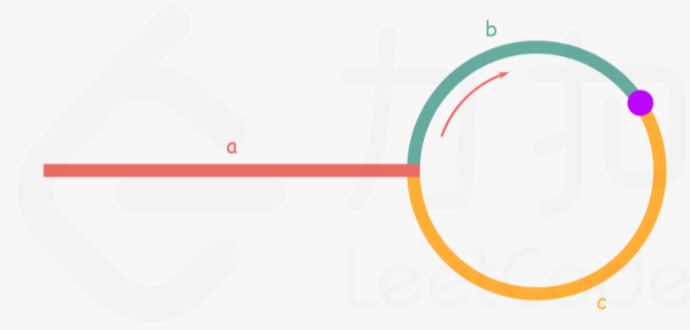
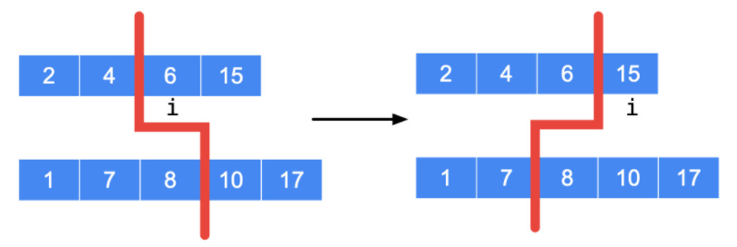
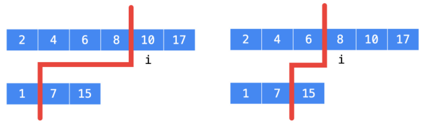

# 算法

## 1 贪心算法

贪心算法采用贪心的策略，保证**每次操作都是局部最优的**，从而使最后得到的结果是**全局最优**的。

- 回溯算法：需要记录每一个步骤 / 选择，用于回答所有具体解的问题；
- 动态规划：需要记录每一个步骤、所有选择的汇总值（最大、最小或者计数）；
- 贪心算法：每一个步骤只有一种选择，一般只需要记录与当前步骤相关的变量的值。


**动态规划需要考虑原问题的所有子问题；**

<div align="center">  </div><br>

**贪心算法每次只需要考虑一个子问题，并且通常是自底向上求解；**


<div align="center">  </div><br>


### 1.1 分配问题

#### [455. 分发饼干](https://leetcode-cn.com/problems/assign-cookies/)

**思路：**

1. 给一个孩子的饼干应当尽量小并且又能满足该孩子，这样大饼干才能拿来给满足度比较大的孩子。
2. 因为满足度最小的孩子最容易得到满足，所以先满足满足度最小的孩子。

具体实现时，由于我们需要获得大小关系，所以我们需要将两个数组分别排序。

```cpp
// 优先满足胃口最小的孩子
class Solution {
public:
    int findContentChildren(vector<int>& g, vector<int>& s) {
        sort(g.begin(), g.end());
        sort(s.begin(), s.end());
        // 从最小的饼干开始，遍历每块饼干
        int res = 0;
        for (int i = 0, j = 0; i < g.size() && j < s.size(); ++j) {
            if (s[j] >= g[i]) {
                ++i;
                ++res; 
            }
        }
        return res;
    }
};
// 优先满足胃口大的孩子
class Solution {
public:
    int findContentChildren(vector<int>& g, vector<int>& s) {
        if (s.empty())  return 0;
        sort(g.begin(), g.end());
        sort(s.begin(), s.end());
        int j = s.size() - 1, res = 0;
        for (int i = g.size() - 1; i >= 0 && j >= 0; --i) {
            if (s[j] >= g[i]) {
                ++res;
                --j;
            }
        }
        return res;
    }
};
```


#### [135. 分发糖果](https://leetcode-cn.com/problems/candy/)

贪心算法思路（两次遍历）：

- 首先，初始化所有孩子的糖果数为 1；

- 从左往右遍历一遍，如果右边孩子的评分比左边的高，则右边孩子的糖果数更新为左边孩子的糖果数加 1；
- 从右往左遍历一遍，如果左边孩子的评分比右边的高，且左边孩子当前的糖果数不大于右边孩子的糖果数，则左边孩子的糖果数更新为右边孩子的糖果数加 1。

贪心策略：在每次遍历中，只考虑并更新相邻一侧的大小关系。

```cpp
class Solution {
public:
    int candy(vector<int>& ratings) {
        int n = ratings.size();     // 学生总数为 n 
        if (n < 2)  return n;
        vector<int> nums(n, 1);     // 初始化：给所有学生 1 颗糖
        for (int i = 1; i < n; ++i) {    // 从左往右遍历
            if (ratings[i - 1] < ratings[i]) {
                nums[i] = nums[i - 1] + 1;
            }
        }
        for (int j = n - 2; j >= 0; --j) {  // 从右往左遍历
            if (ratings[j] > ratings[j + 1] && nums[j] <= nums[j + 1]) {
                nums[j] = nums[j + 1] + 1;
            }
        }
        return accumulate(nums.begin(), nums.end(), 0);
    }
};
// 改进：二次遍历时
//      for (int j = n - 2; j >= 0; --j) {  // 从右往左遍历
//          if (ratings[j] > ratings[j + 1]) {
//              nums[j] = max(nums[j], nums[j + 1] + 1);
//          }
//      }
```

### 1.2 区间问题

#### [435. 无重叠区间](https://leetcode-cn.com/problems/non-overlapping-intervals/)

求最少的移除区间个数，等价于尽量多保留不重叠的区间。在选择要保留区间时，区间的结尾十分重要：选择的区间结尾越小，余留给其它区间的空间就越大，就越能保留更多的区间。贪心策略：优先保留结尾小且不相交的区间。

算法实现：

- 先把区间按照结尾的大小进行增序排序，每次选择结尾最小且和前一个选择的区间不重叠的区间。我们这里使用 C++ 的 Lambda，结合 std::sort() 函数进行自定义排序。
- 在样例中，排序后的数组为 [[1,2], [1,3], [2,4]]。按照我们的贪心策略，首先初始化为区间 [1,2]；由于 [1,3] 与 [1,2] 相交，我们跳过该区间；由于 [2,4] 与 [1,2] 不相交，我们将其保留。因此最终保留的区间为 [[1,2], [2,4]]。

```cpp
class Solution {
public:
    int eraseOverlapIntervals(vector<vector<int>>& intervals) {
        int n = intervals.size();
        if (n == 0)     return 0;
        sort(intervals.begin(), intervals.end(), [](vector<int>& a, vector<int>& b) {
            return a[1] < b[1];
        });
        int removed = 0, prev = intervals[0][1];
        for (int i = 1; i < n; ++i) {
            if (intervals[i][0] < prev) {
                ++removed;
            } else {
                prev = intervals[i][1];
            }
        }
        return removed;
    }
};
```

:zap: 注意：根据实际情况判断按区间开头排序还是按区间结尾排序。

### 1.3 自练题

#### [605. 种花问题](https://leetcode-cn.com/problems/can-place-flowers/)

**"跳格子" 思路**：

- 当遍历到 $flowerbed\ [index]=1$，说明这个位置已经有花，那必然要等到 $index + 2$ 的位置才能种花；
- 当遍历到 $flowerbed\ [index]=0$，由于每次遍历到 1 都是跳两格，因此前一格必然是 0 ，此时需要判断下一格是不是 1 即可的出 $index$ 这一格能不能种花。
  - 可以种花，则令 $n$ 减1，且连跳两格；
  - 不能种花，则连跳三格（因为 $index + 1$ 位置是 1） 

```cpp
class Solution {
public:
    bool canPlaceFlowers(vector<int>& flowerbed, int n) {
        int size = flowerbed.size();
        for (int i = 0; i < size; ) {
            if (flowerbed[i] == 1) {
                i += 2;
            } else if (i == size - 1 || flowerbed[i + 1] == 0) {
                --n;
                i += 2;
            } else {
                i += 3;
            }
        }
        return n <= 0;
    }
};
```

**算法抽象**："花坛"抽象为数组，“种花”抽象为数组相应下标处的元素设置为1，"没种花"抽象为对应下标处的元素为0；

**贪心策略**：根据如下规则，计算数组中可以设置为1的元素个数，判断是否大于或等于n ；

- 两个1之间插入1；

  假设数组的下标 $i$ 和 $j$ 处为1，且下标在 $[i + 1,j - 1 ]$ 范围内都是 0，则只有当 $j - i ≥ 4$ 时才能在下标 $i$ 和 下标 $j$ 之间设置更多的1，且可以设置1 的下标范围为 $[i + 2,j - 2]$，令 $p = j - i -3$，最多可以设置 $p/2$ （$p$为偶数时），$(p+1)/2$个（$p$为奇数时）1。因此，无论 $p$ 是奇数还是偶数，最多可以在该范围内**设置 $(p + 1)/2=(j-i-2)/2$ 个1。**

- 两个1的两侧插入1；

  $[0,1,..,l,...,r,..,m-1]$，假设数组下标 $l$ 处是最左边1，数组下标 $r$ 处是最右边的1，且对于任意的 $k<l或k>r$  都有 $flowerbed[k]=0$ ，计算在下标 $l$ 的左边以及下标 $r$ 的右边最多可以设置多少1。

  下标 $l$ 左边有 $l$ 个位置，当 $l<2$ 时无法在下标 $l$ 左边设置1，当 $l≥2$ 时可以在下标范围 $[0,l-2]$ 内设置1，可以设置1的位置个数为 $l-1$，最多可以**设置 $l/2$ 个1**；

  令 $m$ 为数组的长度，下标 $r$ 的右边有 $m - r -1$ 个位置，可以设置 1 的位置数为 $m-r-2$，最多可以**设置 $(m-r-1)/2$ 个1**；

- 如果数组中元素全为0，则有 $m$ 个位置可以设置1，最多可以**设置 $(m + 1)/2$ 个1**；

**算法步骤**：

- 维护 $prev$ 为上一朵已经种植的花的下标位置，初始时 $prev = -1$，表示没有遇到任何已种植的花；
- 从左往右遍历数组 $flowerbed$ ，当遇到 $flowerbed[i]=1$ 时根据 $prev$ 和 $i$ 的值计算上一个区间内可以种植的花的最多数量，然后令 $prev = i$，继续遍历数组 $flowerbed$ 剩下的元素；
- 遍历数组 $flowerbed$ 结束后，根据数组 $prev$ 和 长度 $m$ 计算最后一个区间内可以种植花的最多数量；
- 判断整个花坛内可以种植花的最多数量是否大于等于 $n$;

 ```cpp
 class Solution {
 public:
     bool canPlaceFlowers(vector<int>& flowerbed, int n) {
         int m = flowerbed.size();
         int count = 0;  // 统计花坛中可种植的花朵数目
         int prev = -1;
         for (int i = 0; i < m; ++i) {
             if (flowerbed[i] == 1) {
                 if (prev == -1) {
                     count += i / 2;     // i对应最左边的1的下标
                 } else {
                     count += (i - prev - 2) / 2;    // 两个1中间
                 }
                 if (count >= n) return true;	// 种花数达到要求
                 prev = i;
             }
         }
         if (prev < 0) {
             count += (m + 1) / 2;   // 花坛中全是0
         } else {
             count += (m - prev - 1) / 2;    // prev 对应最右边的 1下标
         }
         return count >= n;
     }
 };
 ```

#### [452. 用最少数量的箭引爆气球](https://leetcode-cn.com/problems/minimum-number-of-arrows-to-burst-balloons/)

与题目 435 十分类似，但是稍有不同

贪心策略：每次选择右边界位置最靠左的那一个，确定下一支箭，直到所有的气球都被引爆。

```cpp
class Solution {
public:
    int findMinArrowShots(vector<vector<int>>& points) {
        int n = points.size();
        if (n < 2)  return n;

        sort(points.begin(), points.end(), [](vector<int>& a, vector<int>& b) {
            return a[1] < b[1];
        });
        int count = 1;
        int prev = points[0][1];
        for (int i = 1; i < n; ++i) {
            if (points[i][0] <= prev) {		// 区间边界处也是可以引爆的
                continue;
            } 
            ++count;
            prev = points[i][1];		// 再次更新为未引爆气球中右边界最靠左的那个
        }
        return count;
    }
};
```

#### [763. 划分字母区间](https://leetcode-cn.com/problems/partition-labels/)

:bulb: 在处理数组前，统计一遍信息（如频率、个数、第一次出现位置、最后一次出现位置等）可以使题目难度大幅降低。

**贪心策略**：寻找每个片段可能的最小结束下标，保证每个片段的长度一定是符合要求的最短长度。

**算法步骤：**

- 从左到右遍历字符串，统计每个字母最后一次出现的下标位置，遍历的同时维护当前片段的开始下标 $start $ 和结束下标 $end$ ，初始时 $start=end=0$；
- 对每个访问到的字母 $c$，得到当前字母的最后一次出现的下标位置 $end_{c}$，则当前片段的结束下标一定不会小于 $end_c$，因此令 $end = max(end,end_c)$ ；
- 当访问到下标 $end$ 时，当前片段访问结束，当前片段的下标范围是 $[start,end]$，长度为 $end-start+1$，将当前片段的长度添加到返回值，然后令 $start=end + 1$，继续寻找下一个片段；
- 重复上述过程，直到遍历完字符串。

```cpp
class Solution {
public:
    vector<int> partitionLabels(string s) {
        vector<int> last(26);
        for (int i = 0; i < s.size(); ++i) {
            last[s[i] - 'a'] = i;       // 统计字符串中每个字母最后一次出现的下标位置
        }
        vector<int> res;
        int start = 0, end = 0;
        for (int j = 0; j < s.size(); ++j) {
            end = max(end, last[s[j] - 'a']);       // 寻找每个片段最小的结束下标位置
            if (j == end) {     // 子片段结束
                res.push_back(end - start + 1);
                start = end + 1;
            }
        }
        return res;
    }
};
```

#### [122. 买卖股票的最佳时机 II](https://leetcode-cn.com/problems/best-time-to-buy-and-sell-stock-ii/)

问题：寻找 $x$ 个不相交的区间 $(l_i,r_i]$ 使得如下的等式最大化：
$$
\sum_{i=1}^{x} a[r i]-a[l i]
$$
问题转化为：寻找 $x$ 个长度为 1 的区间 $(l_i, l _i + 1]$ 使得 $\sum_{i=1}^{x} a\left[l_{i}+1\right]-a\left[l_{i}\right]$ 价值最大化。

贪心的角度考虑我们每次选择贡献大于 0 的区间即能使得答案最大化，因此最后答案为：
$$
\text { ans }=\sum_{i=1}^{n-1} \max \{0, a[i]-a[i-1]\}
$$
**贪心策略**：只要今天的股价比昨天高就进行交易。对于【今天的股价 - 昨天的股价】，得到的结果只有 3 种可能：正数，0和负数。

```cpp
class Solution {
public:
    int maxProfit(vector<int>& prices) {
        int n = prices.size();
        int profit = 0;
        for (int i = 1; i < n; ++i) {
            profit += max(0, prices[i] - prices[i - 1]);
        }
        return profit;
    }
};
```

> 1. [股票问题系列通解](https://leetcode-cn.com/circle/article/qiAgHn/)
>
> 2. [股票问题详解](https://leetcode-cn.com/problems/best-time-to-buy-and-sell-stock-ii/solution/tan-xin-suan-fa-by-liweiwei1419-2/)

#### [406. 根据身高重建队列](https://leetcode-cn.com/problems/queue-reconstruction-by-height/) _*

本题同时需要排序和插入操作。

#### [665. 非递减数列](https://leetcode-cn.com/problems/non-decreasing-array/) _*

本题需要思考你的贪心策略在各种情况下，是否仍然是最优解。


## 2 双指针

<u>双指针</u>主要用于遍历数组，两个指针指向不同的元素，从而协同完成任务。

若两个指针指向同一数组，遍历方向相同且不会相交，则称为<u>滑动窗口</u>（两个指针包围的区域即为当前的窗口），常用于区间搜索。

若两个指针指向同一数组，但是遍历方向相反，则可以用来进行搜索，待搜索的数组往往是排好序的。

**指针与常量**

```cpp
int x;
int * p1 = &x; 			// 指针可以被修改，值也可以被修改
const int * p2 = &x; 	// 指针可以被修改，值不可以被修改（const int）
int * const p3 = &x; 	// 指针不可以被修改（* const），值可以被修改
const int * const p4 = &x; // 指针不可以被修改，值也不可以被修改
```

**指针函数与函数指针**

```cpp
// addition是指针函数，一个返回类型是指针的函数
int* addition(int a, int b) {
	int* sum = new int(a + b);
	return sum;
}
int subtraction(int a, int b) {
	return a - b;
}
int operation(int x, int y, int (*func)(int, int)) {
	return (*func)(x,y);
}
// minus是函数指针，指向函数的指针
int (*minus)(int, int) = subtraction;
int* m = addition(1, 2);
int n = operation(3, *m, minus);
```

### 2.1 两数之和

#### [167. 两数之和 II - 输入有序数组](https://leetcode-cn.com/problems/two-sum-ii-input-array-is-sorted/)

本题中数组是已排序数组，我们采用方向相反的双指针寻找两个数。

算法思路：

- 初始化：一个指针指向数组最左侧元素（最小元素），向左遍历；另一个指针指向数组的最右侧元素（最大元素）向右遍历。
- 如果<u>左右指针指向元素之和</u> $sum$ 等于 $target$ ，$break $ 跳出循环；如果 $sum < target$ 就将左指针右移一位，使当前和增加一些；如果 $sum > target$ 就将右指针左移一位，使当前和减少一些。

```cpp
class Solution {
public:
    vector<int> twoSum(vector<int>& numbers, int target) {
        int lhs = 0, rhs = numbers.size() - 1, sum;
        while (lhs != rhs) {
            sum = numbers[lhs] + numbers[rhs];	// 左右指针指向元素之和
            if (sum == target)      break; 
            else if (sum < target)  ++lhs; 
            else    --rhs;
        }
        return vector<int>{lhs + 1, rhs + 1};
    }
};
```


### 2.2 归并两个有序数组

#### [88. 合并两个有序数组](https://leetcode-cn.com/problems/merge-sorted-array/)

​		本题中数组已经排好顺序，因此可将**两个指针分别放在两个数组的末尾**，即 $nums1$ 的 $m - 1$ 位和 $nums2$ 的 $n - 1$ 位。每次将较大的数字复制到 $nums1$ 的后面，然后向前移动一位。因此，这里需要**第三个指针来定位 $nums1$ 的末尾**。

​		算法中，直接利用 $m$ 和 $n$ 作为两个数组的指针，并额外设置一个 $index$ 指针，起始位置为 $m+n-1$ 。每次向前移动 $m$ 或 $n$ 时，我们也需要向前移动 $index$ 。此外，如果 $nums1$ 数组已经复制完，就要继续复制 $nums2$ 数组；如果 $nums2$ 数组已经复制完毕，剩下的 $nums1$ 数组不需要改变，因为他们已经排好顺序。

:bulb: $++$ 和 $--$ 的使用技巧：a++ 和 ++a 都是将 a 加 1，但是 a++ 返回值为 a，而 ++a 返回值为 a + 1。如果只希望增加 a 的值，而不需要返回值，则推荐使用 ++a，其运行速度更快。

```cpp
class Solution {
public:
    void merge(vector<int>& nums1, int m, vector<int>& nums2, int n) {
        int index = m-- + n-- - 1;
        while (m >= 0 && n >= 0) {
            nums1[index--] = (nums1[m] > nums2[n] ? nums1[m--] : nums2[n--]);
        }
        while (n >= 0) {
            nums1[index--] = nums2[n--];
        }
    }
};
```


### 2.3 快慢指针

#### [142. 环形链表 II](https://leetcode-cn.com/problems/linked-list-cycle-ii/)

针对链表找环路的问题，可通过[快慢指针](https://zh.wikipedia.org/wiki/Floyd判圈算法)（Floyd 判圈法）以及Brent判圈算法解决。

算法步骤：

- 给定两个指针分别命名为 slow 和 fast，起始位置在链表的开头。每次 fast 前进两步，slow 前进一步。

- **如果 fast可以走到尽头，那么说明没有环路**；**如果 fast 可以无限走下去，那么说明一定有环路**，且一定存在一个时刻 slow 和 fast 相遇。
- <u>当 slow 和 fast 第一次相遇</u>时，我们将 fast 重新移动到链表开头，并让 slow 和 fast 每次都前进一步。<u>当 slow 和 fast 第二次相遇</u>时，相遇的节点即为环路的开始点。

```cpp
class Solution {
public:
    ListNode *detectCycle(ListNode *head) {
        ListNode *fast = head, *slow = head;
        // Floyd判圈算法：判断是否存在环路
        while (fast != nullptr && fast->next != nullptr && slow != nullptr) {
            fast = fast->next->next;
            slow = slow->next;
            // 如果存在，查找环路节点
            if (fast == slow) {
                fast = head;
                while (fast != slow) {
                    fast = fast->next;
                    slow = slow->next;
                }
                return slow;
            }
        }
        return nullptr;
    }
};
```

> 数学推导——[Leetcode题解)](https://leetcode-cn.com/problems/linked-list-cycle-ii/solution/huan-xing-lian-biao-ii-by-leetcode-solution/)

<div align="center">  </div><br>

假设链表中环外部分的长度为 $a$ ，slow 指针进入环后，又走了 $b$ 的距离与 fast 相遇。此时 fast 已经在环中走了 $n$ 圈，因此它走过的总距离为：
$$
a+n*(b + c)+b=a+(n + 1)*b+n*c
$$
由题设知，fast 指针走过的距离为 slow 指针走过距离的 2 倍，因此有：
$$
a+(n + 1)*b+n*c=2(a+b)\\
\Rightarrow a=c+(n-1)*(b+c)
$$
由此可得，从相遇点到入环点的距离加上 $n-1$ 圈的环长，恰好等于从链表头部到入环点的距离。

### 2.4 滑动窗口

#### [76. 最小覆盖子串](https://leetcode-cn.com/problems/minimum-window-substring/)

思路：两个指针 $l$ 和 $r$ 都是从最左端向最右端移动，且  $l$ 的位置一定在  $r$  的左边或重合。

注意本题虽然在 for 循环里出现了一个 while 循环，但是因为 while 循环负责移动 $l$ 指针，且 $l$ 只会从左到右移动一次，因此总时间复杂度仍然是 *O*(*n*)。

本题使用了<u>长度为 128 的数组来映射字符</u>，也可以用<u>哈希表</u>替代；其中 chars 表示目前每个字符缺少的数量，flag 表示每个字符是否在字符串 t 中存在。

**如何判断当前的窗口包含 t 中所有的字符？**

用一个哈希表表示 t 中所有的字符以及它们的个数，用一个哈希表动态维护窗口中所有的字符以及它们的个数，如果这个动态表中包含 t 的哈希表中的所有字符，并且对应的个数都不小于 t 的哈希表中各个字符的个数。

```cpp
class Solution {
public:
    string minWindow(string s, string t) {
        vector<int> chars(128, 0);
        vector<bool> flag(128, false);
        // 先统计T 中的字符情况
        for (int i = 0; i < t.size(); ++i) {
            flag[t[i]] = true;
            ++chars[t[i]];
        }
        // 移动滑动窗口，不断更改统计数据
        int cnt = 0, l = 0, min_l = 0, min_size = s.size() + 1;
        for (int r = 0; r < s.size(); ++r) {
            if (flag[s[r]]) {
                if (--chars[s[r]] >= 0) {
                    ++cnt;
                }
                // 若目前滑动窗口已包含T中全部字符
                // 尝试将 l 右移，在不影响结果的情况下获得最短字符串
                while (cnt == t.size()) {
                    if (r - l + 1 < min_size) {
                        min_l = l;
                        min_size = r - l + 1;
                    }
                    if (flag[s[l]] && ++chars[s[l]] > 0) {
                        --cnt;
                    }
                    ++l;
                }
            }
        }
        return min_size > s.size() ? "" : s.substr(min_l, min_size);
    }
};
```


> [LeetCode官方题解(更易懂)](https://leetcode-cn.com/problems/minimum-window-substring/solution/zui-xiao-fu-gai-zi-chuan-by-leetcode-solution/)

### 2.5 自练题

#### [633. 平方数之和](https://leetcode-cn.com/problems/sum-of-square-numbers/)

**思路**：假设 $left ≤ right$，初始化 $left = 0, right = \sqrt c$，当 $left=right$ 时查找结束，如果此时仍然没有找到整数符合要求的 $left$ 和 $right$ 则说明没有。

```cpp
class Solution {
public:
    bool judgeSquareSum(int c) {
        long left = 0, right = (int)sqrt(c);
        while (left <= right) {
            long sum = left * left + right * right;
            if (sum == c)   return true;
            else if (sum < c)   ++left;
            else --right;
        }
        return false;
    }
};
```

#### [680. 验证回文字符串 Ⅱ](https://leetcode-cn.com/problems/valid-palindrome-ii/)

Two Sum 题目的变形题之二。

```cpp
class Solution {
public:
    bool validPalindrome(string s) {
        int i = 0, j = s.size() - 1;
        while (i < j) {
            if (s[i] != s[j]) {
                return isPalindrome(s, i + 1, j) || isPalindrome(s, i, j - 1);
            } else {
                ++i;
                --j;
            }
        }
        return true;
    }
private:
    bool isPalindrome(string s, int i, int j) {
        for (int left = i, right = j; left < right; ++left, --right) {
            if (s[left] != s[right])   return false;
        }
        return true;
    }
};
```


#### [524. 通过删除字母匹配到字典里最长单词](https://leetcode-cn.com/problems/longest-word-in-dictionary-through-deleting/)

归并两个有序数组的变形题。

```cpp
class Solution {
private:
    bool isSubstr(string& s, string& target) {      // target 是否是字符串s的子字符串
        int index1 = 0, index2 = 0;
        while(index1 < s.length() && index2 < target.length()) {
            if (s[index1] == target[index2]) {
                index2++;		// 匹配 target 的一个字符
            }
            index1++;
        }
        return index2 == target.length();
    }
public:
    string findLongestWord(string s, vector<string>& dictionary) {
        string longestWord = "";
        // 依次遍历dictionary
        for (auto target : dictionary) {
            int l1 = longestWord.size(), l2 = target.size();
            if (l1 > l2 || (l1 == l2 && longestWord.compare(target) < 0)) {
                continue;       // 长度最长且字典序最小的字符串
            }
            if (isSubstr(s, target)) {
                longestWord = target;
            }
        }
        return longestWord;
    }
};
```


## 3 二分查找

<u>二分查找</u> （二分法 or 折半查找）：每次查找时通过将待查找区间分成两部分并只取一部分继续查找，将查找的复杂度大大减少。对于一个长度为 $O(n)$ 的数组，二分查找的时间复杂度为 $O(log n)$。

具体在代码中，二分查找时区间的左右端取开区间还是闭区间在绝大多数时候都可以，关于如何定义区间开闭性。这里有两个小诀窍：

1. 尝试熟练使用一种写法，如左闭右开（满足 C++ 、Python 等语言的习惯）或者左闭右闭（便于处理边界条件），尽量只保持这一种写法；
2. 在刷题时思考如果最后区间只剩下一个数或者两个数，自己的写法是否会陷入死循环，如果某种写法无法跳出死循环，则考虑尝试另一种写法。

二分查找可以看成双指针的一种特殊情况。双指针类型的题，指针通常是一步一步移动的，二分查找里，指针每次移动半个区间长度。


**二分查找的三种写法：**

<u>二分法关键在于掌握</u>：退出循环时，`left` 和 `right` 的位置关系。

| 形式                     | 结论与建议                                                   |
| ------------------------ | ------------------------------------------------------------ |
| while (left <= right)    | 简单问题用，在循环体里能找到答案以后退出。                   |
| while (left < right)     | 复杂问题用，把答案留到退出循环后再判断。解决二分问题的利器，尤其在边界问题用，这种方式考虑细节最少，但需要一定练习才能灵活运用。 |
| while (left + 1 < right) | 不建议用，本质上和 while (left <= right) 写法一样，盲目套用反而学不会二分。 |


`while(left < right)` 写法的优势在于退出循环时 `left` 和 `right` 是重合`while(left < right)` 写法的 [参考题解](https://leetcode-cn.com/problems/search-insert-position/solution/te-bie-hao-yong-de-er-fen-cha-fa-fa-mo-ban-python-/) 。

`while(left < right)` 和 `while(left <= right)`  写法的区别：

- `while(left <= right)` 在退出循环时有 `left = right + 1`，即 `right` 在左，`left` 在右；
- `while(left < right)` 在退出循环时，有 `left =right` 成立；

经验是：如果要找的数的性质很简单，使用这种写法，在循环体找到了就退出；在一些复杂问题中，列如找一些边界的值（比如 34 题），用 `while(left < right)`  是更加简单的，将要找的数字放在最后，在退出循环以后做判断。最重要的是退出循环后有 `left = right` 成立，这种思考问题的方式不容易出错。

`while(left < right)`  的写法难点在于理解：分支的取法决定中间数的取法。


> [二分查找有几种写法？它们的区别是什么？ - 知乎](https://www.zhihu.com/question/36132386/answer/530313852)
>
> [二分查找 - 搜索插入位置 - 力扣](https://leetcode-cn.com/problems/search-insert-position/solution/te-bie-hao-yong-de-er-fen-cha-fa-fa-mo-ban-python-/)


### 3.1 求开方

#### [69. x 的平方根](https://leetcode-cn.com/problems/sqrtx/)

**解法1**：如果一个数 $a$ 的平方大于 $x$，那 $a$ 一定不是 $x$ 的平方根，我们下一轮需要在 $[0, a-1]$ 区间内继续查找 $x$ 的平方根。其中，为了防止除以 0，我们将 $a = 0$ 的情况单独考虑，然后对区间 $[1, a]$ 进行二分查找。

```cpp
class Solution {
public:
    int mySqrt(int x) {
        if (x == 0) return 0;
        if (x == 1) return 1;
        int l = 1, r = x / 2;
        while (l < r) {
            int mid = l + (r - l + 1) / 2;      //  (l + r) / 2 的结果向上取整
            if (mid  > x / mid)     r = mid - 1;    // [left , mid - 1]
            else l = mid;                       // 下一轮搜索区间为 [mid, right]
        }
        return l;
    }
};
```

**解法2**：牛顿迭代法。公式为 $x_{n + 1} = x_n-f(x_n)/f^{\prime}\left(x_{n}\right)$ 。给定 $f(x)=x^2-a=0$，这里的迭代公式为 $x_{n + 1}=(x_n+a/x_{n})/2$。

```cpp
class Solution {
public:
    int mySqrt(int x) {
        long a = x;
        while (a * a > x) {
            a = (a + x / a) / 2;
        }
        return a;
    }
};
```


### 3.2 查找区间

#### [34. 在排序数组中查找元素的第一个和最后一个位置](https://leetcode-cn.com/problems/find-first-and-last-position-of-element-in-sorted-array/)

采用 `while(left <= right)` 这种写法，并分析如何在循环体中设置 $left$ 和 $right$ ，以及应该返回 $left$ 和 $right$ ，即怎样思考边界问题。

<u>首先，查找 target 出现的第一个位置。</u>

二分查找的基本用法是在一个有序数组里查找目标元素，具体是看区间中间元素的值 $nums[mid]$ 和 $target$ 的大小关系。

- 若 $nums[mid] =target$ ，直接返回；
- 若 $nums[mid]<target$，往右边查找；
- 若 $nums[mid]>target$，往右边查找；

具体到本题中，由于一个元素出现多次，在讨论时我们需要进行调整：

- 如果当前遍历到的元素 **等于** $target$ ，那么当前元素可能是 $target$ 出现的第1 个位置，于是我们在左边 $[left,mid-1]$  继续查找。
- 如果当前遍历到的元素 **严格大于** $target$ ，那么我们在 $mid$ 左边 $[left,mid-1]$ 继续查找 $target$ 出现的第1 个位置。
- 如果当前遍历到的元素 **严格小于** $target$ ，那么我们在 $mid$ 右边 $[mid+1,right]$ 继续查找 $target$ 出现的第1 个位置。


```cpp
// 查找 target 第1次出现的位置
int findFirstPosition(vector<int> &nums, int target) {
    int left = 0, right = nums.length() - 1;
    while (left <= right) {
        int mid = left + (right - left) / 2;
        if (nums[mid] == target) {			// 继续在左边找[left, mid - 1]
            right = mid - 1;
        } else if (nums[mid] < target) {	// [mid + 1, right]
            left = mid + 1;
        } else {	// 继续在左边找 [left, mid - 1]
            right = mid - 1;
        }
    }
    // 此时 left 和 right 的位置关系是 [right, left]，注意left 才是第1次元素出现的位置
    // 因此需要一次特判
    if (left != nums.size() && nums[left] == target) {
        return left;
    }
    return -1;
}


// 查找 target 最后1次出现的位置
int findLastPosition(vector<int> &nums, int target) {
    int left = 0, right = nums.size() - 1;
    while (left <= right) {
        int mid = left + (right - left) / 2;
        if (nums[mid] == target) {			// 右边继续找[mid + 1, right]
            left = mid + 1;
        } else if (nums[mid] < target) {	// 右边继续找[mid + 1, right]
            left = mid + 1;
        } else {		// 左边继续找 [left, mid - 1]
            right = mid - 1;
        }
    }
    return right;
}
```

**注意**：查找 $target$ 最后一个位置时无需讨论不存在的情况，因为先执行了 $findFirstPosition()$ 函数，如果该函数返回 $-1$ ，显然知道数组中不存在目标元素，可以直接返回 $[-1, -1]$。

```cpp
// 主调函数
if (nums.size() == 0) {
    return {-1, -1};
}
int firstPosition = findFirstPosition(nums, target);
// 如果第1次出现位置找不到，肯定不存在最后1次出现的位置
if (firstPosition == -1) {
    return {-1, -1};
}
int lastPosition = findLastPosition(nums, target);
return {firstPosition, lastPosition};
```


方法2：不利用 $findFirstPosition()$  结果的版本，和完整代码 1 没有本质上的区别。注意分支逻辑中有 $right = mid - 1$ ，因此 $right$ 有可能等于 $-1$ 。所以退出循环以后要判断的逻辑是：

```cpp
if (right != -1 && nums[right] == target) {
    return right;
}
```

完整的代码如下：

```cpp
class Solution {
public:
    vector<int> searchRange(vector<int>& nums, int target) {
        if(nums.empty())    return{-1, -1};
        int firstPosition = findFirstPosition(nums, target);
        int lastPosition = findLastPosition(nums, target);
        return {firstPosition, lastPosition};
    }
private:
    int findFirstPosition(vector<int>& nums, int target) {
        int lhs = 0, rhs = nums.size() - 1;
        while (lhs <= rhs) {
            int mid = lhs + (rhs - lhs) / 2;
            if (nums[mid] == target) {  // 需要在 [left, mid - 1] 区间继续查找
                rhs = mid - 1;
            } else if (nums[mid] < target) {
                lhs = mid + 1;
            } else {
                rhs = mid - 1;
            }
        }
        // 此时 [right, left], 注意判断left 是否越界
        if (lhs != nums.size() && nums[lhs] == target) {
            return lhs;
        }
        return -1;
    }
    int findLastPosition(vector<int>& nums, int target) {
        int lhs = 0, rhs = nums.size() - 1;
        while (lhs <= rhs) {
            int mid = lhs + (rhs - lhs) / 2;
            if (nums[mid] == target) {  // 需要在 [mid + 1, right] 区间继续查找
                lhs = mid + 1;
            } else if (nums[mid] < target) {
                lhs = mid + 1;
            } else {
                rhs = mid - 1;
            }
        }
        if (rhs != -1 && nums[rhs] == target) {
            return rhs;
        }
        return -1;
    }
};
```

### 3.3 旋转数组查找数字

解题思路：若 `nums[mid]<= nums[right]` ，则说明右区间是有序的；反之，则说明左区间是有序的。

如果 `target` 位于有序区间内，我们可以对这个区间继续二分查找；反之，我们对另外一半区间继续二分查找。

注意，因为数组中存在重复数字，若 `nums[mid]=nums[left]` ，由于我们不能确定是左区间全部相同，还是右区间完全相同。此时，我们 `++left`，然后继续二分查找。

```cpp
bool search(vector<int>& nums, int target) {
    int left = 0, right = nums.size() - 1;
    while (left <= right) {
        int mid = left + (right - left) / 2;
        if (nums[mid] == target)        return true;
        if (nums[left] == nums[mid]) {  // 无法判断哪个区间是增序的
            ++left;
        } else if (nums[mid] <= nums[right]) {
            // 右区间是增序的
            if (nums[mid] < target && target <= nums[right]) {
                left = mid + 1;
            } else {
                right = mid;
            }
        } else {
            // 左区间是增序的
            if (nums[left] <= target && target < nums[mid]) {
                right = mid - 1;
            } else {
                left = mid;
            }
        }
    }
    return false;
}
```

### 3.4 自练题

#### [154. 寻找旋转排序数组中的最小值 II](https://leetcode-cn.com/problems/find-minimum-in-rotated-sorted-array-ii/)

思路：将 `nums[mid]` 和 `nums[right]` 进行比较，得到的结果有三种情况：

- `<` ，说明 `nums[mid]` 是右侧的最小元素，我们忽略二分查找的右半部分；
- `>` ，说明 `nums[mid]` 是最小值左侧的元素，我们忽略二分查找的左半部分；
- `=` ，说明 存在重复元素，但我们不能确定 `nums[mid]` 是在最小值的左侧还是右侧，因此我们不能随意忽略某一部分元素。我们唯一可以确定的是，由于它们的值相同，无论 `nums[right]` 是不是最小值，都可以执行 `--right`，这是因为我们取 `mid` 时是向下取整。

```cpp
int findMin(vector<int>& nums) {
    int left = 0, right = nums.size() - 1;
    while (left < right) {
        int mid = left + (right - left) / 2;
        if (nums[mid] < nums[right]) {
            right = mid;
        } else if (nums[mid] > nums[right]) {
            left = mid + 1;
        } else {
            --right;
        }
    }
    return nums[right];
}
```

#### [540. 有序数组中的单一元素](https://leetcode-cn.com/problems/single-element-in-a-sorted-array/)

解法1：含有单个元素的子数组元素个数为奇数。

- `nums[mid]` 的同一元素在右边，且 `mid` 分成两半的数组为<u>偶数</u>。将右子数组的第一个元素移除之后，则右子数组的元素个数变为<u>奇数</u>，应设置 `lo = mid + 2` 。
- `nums[mid]` 的同一元素在右边，且 `mid` 分成两半的数组为<u>奇数</u>。将右子数组的第一个元素移除之后，则右子数组的元素个数变为<u>偶数</u>，应设置 `hi = mid -1` 。
- `nums[mid]` 的同一元素在左边，且 `mid` 分成两半的数组为<u>偶数</u>。将左子数组的最后一个元素移除之后，则左子数组的元素个数变为<u>奇数</u>，应设置 `hi = mid -2` 。
- `nums[mid]` 的同一元素在左边，且 `mid` 分成两半的数组为<u>奇数</u>。将左子数组的最后一个元素移除之后，则左子数组的元素个数变为偶数，应设置 `lo = mid +1` 。

  ```cpp
  int singleNonDuplicate(vector<int>& nums) {
      int l = 0, r = nums.size() - 1;
      while (l < r) {
          int mid = l + (r - l) / 2;
          int flag = (r - mid) % 2;   // flag 为 1 为奇数， 0 为偶数
          if (nums[mid] == nums[mid + 1]) {
              if (flag) {
                  r = mid - 1;
              } else {
                  l = mid + 2;
              }
          } else if (nums[mid] == nums[mid - 1]){
              if (flag) {
                  l = mid + 1;
              } else {
                  r = mid - 2;
              }
          } else {
              return nums[mid];
          }
      }
      return nums[l];
  }
  ```

解法2：异或运算

```cpp
int singleNonDuplicate(vector<int>& nums) {
    int ans = 0;
    for (const int &num : nums) {
        ans ^= num;
    }
    return ans;
}
```

解法3：设置 `l` 和 `r` 为数组的首尾，奇数长度数组的首尾元素索引都是偶数。

- 首先，确保 `mid` 是偶数，如果是奇数，则将其减 1；
- 然后，检查 `mid` 的元素是否与后面的索引相同。若相同，我们知道 `nums[mid]` 不是单个元素，且单个元素在 `mid` 之后。因此，设置 `l = mid + 2`；如果不相同，我们知道单个元素位于 `mid` ，或者在 `mid` 之前，因此将 `r = mid`。
- 最后 `l=r` ，当前搜索空间为 1 个元素，那么该元素为单个元素。

```cpp
int singleNonDuplicate(vector<int>& nums) {
    int l = 0, r = nums.size() - 1;
    while (l < r) {
        int mid = l + (r - l) / 2;
        if (mid % 2 == 1) {
            --mid;
        }
        if (nums[mid] == nums[mid + 1]) {
            l = mid + 2;
        } else {
            r = mid;
        }
    }
    return nums[l];
}
```

#### [4. 寻找两个正序数组的中位数](https://leetcode-cn.com/problems/median-of-two-sorted-arrays/)

核心思想：

- 使用二分查找确定两个有序数组的分割线，中位数就由分割线左右两侧的元素决定；
- 分割线性质：左右两边的元素个数相等（这里忽略两个数组长度之和与奇偶性的差异）；
- 分割线左边所有元素 `≤` 分割线右边所有元素；
- 由于分割线两边元素个数相等，挪动分割线就会有此消彼长的现象，所以使用二分法定位。

**二分查找：**

1. 只有一个有序数组的时候中位数的性质

   从中位数定义出发，在只有一个有序数组时：

   - 如果数组的元素个数是<u>偶数</u>，中位数就是数组分割线两边的两个元素的平均值；
   - 如果数组的元素个数是<u>奇数</u>，我们让分割线左边多一个元素，此时分割线的左边的那个元素就是这个有序数组的中位数；

2. 两个有序数组的时候中位数的性质

   - 当数组的总长度为<u>偶数</u>的时候，分割线左右的数字个数总和相等；当数组的总长度为<u>奇数</u>时，分割线左边数字个数比右边多1个；
   - 分割线左边所有元素都小于等于分割线右边的所有元素；

   如果这条分割线可以找到，那么中位数就可以确定，同样得分奇偶性：

   - 当数组的总长度为偶数时，中位数就是分割线左边的最大值和右边的最小值的平均数；
   - 当数组的总长度为奇数时，中位数就是分割线左边的最大值。因此在数组长度是奇数的时候，中位数就是分割线左边的最大值。

   由于两个数组本身都是有序数组，因此我们需要判定交叉关系中，是否满足左边依然小于等于右边即可，即

   - 第1个数组分割线左边的数 `≤` 第2个数组分割线右边的数；
   - 第2个数组分割线左边的数 `≤` 第1个数组分割线右边的数；

3. 通过不断缩减搜索区间确定分割线的位置

   分割线左边的元素总数是固定的，我们只需确定1个数组上元素的位置，另一个位置自然就可以确定。

   - 当数组的总长度为偶数时，左边共有 `(nums1.length() + nums2.length())/ 2` 个元素；
   - 当数组的总长度为奇数时，左边共有 `(nums1.length() + nums2.length()) / 2 + 1` 个元素；
   - 改进：两种情况下，左边元素个数都可以表述为： `(nums1.length() + nums2.length() + 1) / 2 ` 个元素；（上取整）

4. 简化问题、细化算法流程

   问题重述：在其中一个数组中找到 `i` 个元素，则另一个数组的元素个数就是 `(len(nums1) + len(nums2) + 1) / 2 - i` 。

   至于找 `i` 个元素，可先找索引为 `i` 的元素，因为下标是从 0 开始编号，因此编号为 `i` 的元素，就是前面有 `i` 个元素。因此，`i` 是第1个数组分割线右边的第一个元素。

   <u>情况1</u>：此时分割线左边的元素总数比右边多1，但是第 1 个数组分割线右边第 1 个数 6 小于第 2 个数组分割线左边第 1 个数 8。说明，分割线要右移。

   <div align="center">  </div><br>

   <u>情况2</u>：此时分割线左边的元素总数比右边多 1，但是第 1 个数组分割线左边第1个数8大于第2个数组分割线左边第1个数7。说明，第1个数组的分割线要左移。

   <div align="center">  </div><br>

5. 特殊情况

   假设我们要在一个短的数组上搜索 `i` 。搜索过程中，我们需要比较分割线左边的数和右边的数。`nums[i]、nums[i - 1]、nums[j]、nums[j - 1]`，因此这几个数的下标不能越界。

   - 考虑`nums1` 
     - 当`i=0 ` 时，对应数组 `nums1` 在分割线左边为空，可设置 `nums1_left_max=负无穷`；
     -  当 `i=m` 时，对应数组 `nums1` 在分割线右边空，可以设置 `nums1_right_min=正无穷`。

   - 考虑 `nums2` 
     - 当 `j=0` 时，对应数组 `nums2` 在分割线左边为空，可设置 `nums_left_max=负无穷`。
     - 当 `j=n` 时，对应数组 `nums2` 在分割线右边为空，可设置 `nums2_right_min=正无穷`  。

```cpp
double findMedianSortedArrays(vector<int>& nums1, vector<int>& nums2) {
    if (nums1.size() > nums2.size()) {
        vector<int> temp = nums1;
        nums1 = nums2;
        nums2 = temp;
    }
    int m = nums1.size();
    int n = nums2.size();
    // 分割线左边的所有元素需满足的个数为 m + (n - m + 1) / 2
    int totalLeft = (m + n + 1) / 2;
    // 在 nums1 的区间 [0, m] 内查找恰当的分割线
    // 满足交叉大小比 nums1[i - 1] <= nums2[j] && nums2[j - 1] <= nums1[i]
    int left = 0, right = m;
    while (left < right) {
        int i = left + (right - left + 1) / 2;
        int j = totalLeft - i;
        if (nums1[i - 1] >nums2[j]) {
            // 下一轮搜索区间为 [left, i - 1]
            right = i - 1;
        } else {
            // 下一轮搜索区间为 [i, right]
            left = i;
        }
    }
    int i = left;
    int j = totalLeft - i;
    int nums1LeftMax = i == 0? INT_MIN : nums1[i - 1];
    int nums1RightMin = i == m ? INT_MAX : nums1[i];
    int nums2LeftMax = j == 0 ? INT_MIN : nums2[j - 1];
    int nums2RightMin = j == n ? INT_MAX : nums2[j];
    if (((m + n) % 2) == 1) {
        return max(nums1LeftMax, nums2LeftMax);
    } else {
        return (double)(max(nums1LeftMax, nums2LeftMax) + min (nums1RightMin, nums2RightMin)) / 2;
    }
}
```

> [二分查找](https://leetcode-cn.com/problems/median-of-two-sorted-arrays/solution/he-bing-yi-hou-zhao-gui-bing-guo-cheng-zhong-zhao-/)


## 4 排序算法

### 4.1 常用排序算法

#### 快速排序

```cpp
void quickSort(vector<int> &nums, int l, int r) {
    if (l + 1 >= r) {
        return;
    }
    int first = l, last = r - 1, key = nums[first];
    while (first < last) {
        while (first < last && nums[last] >= key) {
            --last;
        }
        nums[first] = nums[last];
        while (first < last && nums[first] <= key) {
            ++first;
        }
        nums[last] = nums[first];
    }
    nums[first] = key;
    quickSort(nums, l, first);
    quickSort(nums, first + 1, r);
}
```

#### 归并排序

```cpp
void mergeSort(vector<int> &nums, int l, int r, vector<int> &temp) {
    if (l + 1 >= r) {
        return;
    }
    // divide
    int m = l + (r - l) / 2;
    mergeSort(nums, l, m, temp);
    mergeSort(nums, m, r, temp);
    // conquer
    int p = l, q = m, i = l;
    while (p < m || q < r) {
        if (q >= r || (p < m && nums[p] <= nums[q])) {
            temp[i++] = nums[p++];
        } else {
            temp[i++] = nums[q++];
        }
    }
    for(int i = l; i < r; ++i) {
        nums[i] = temp[i];
    }
}
```

#### 插入排序

```cpp
void insertionSort(vector<int> &nums, int n) {
    for (int i = 0; i < n; ++i) {
        for (int j = i; j > 0 && nums[j] < nums[j - 1]; --j) {
            swap(nums[j], nums[j - 1]);
        }
    }
}
```

#### 冒泡排序

```cpp
void bubbleSort(vector<int> &nums, int n) {
    bool swapped;
    for (int i = 1; i < n; ++i) {
        swapped = false;
        for (int j = 1; j < n - i + 1; ++j) {
            if (nums[j] < nums[j - 1]) {
                swap(nums[j], nums[j - 1]);
                swapped = true;
            }
        }
        if (!swapped) {
            break;
        }
    }
}
```

#### 选择排序

```cpp
void selectionSort(vector<int> &nums, int n) {
    int mid;
    for (int i = 0; i < n - 1; ++i) {
        mid = i;
        for (int j = i + 1; j < n; ++j) {
            if (nums[j] < nums[mid]) {
                mid = j;
            }
        }
        swap(nums[mid], nums[i]);
    }
}
```

### 4.2 快速选择

#### [215. 数组中的第K个最大元素](https://leetcode-cn.com/problems/kth-largest-element-in-an-array/)

分析：<u>快速排序</u>一般用于求解 k-th Element 问题，可以在 $O(n)$ 时间复杂度，$O(1)$ 空间复杂度完成求解工作。快速选择的实现和快速排序相似，不过只需要找到第 k 大的 pivot 即可，不需要对其左右再进行排序。与快速排序一样，快速选择一般需要先打乱数组，否则最坏情况下时间复杂度为 $O(n^2)$ 。

```cpp
// z
```


## 5 BFS & DFS

## 6 动态规划

## 7 分治与递归